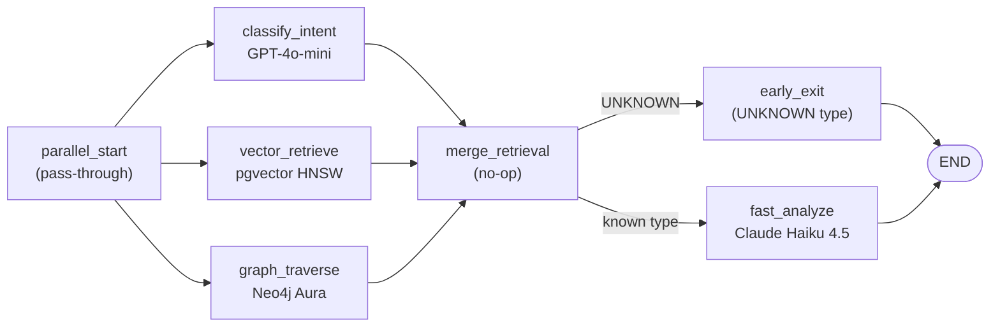
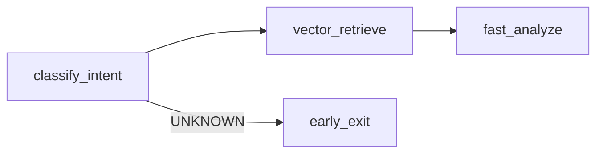
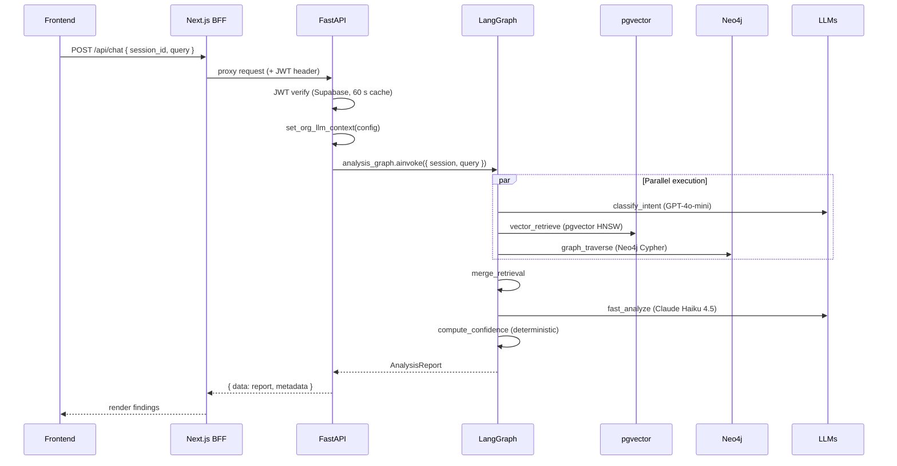
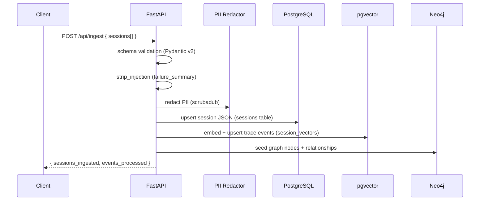
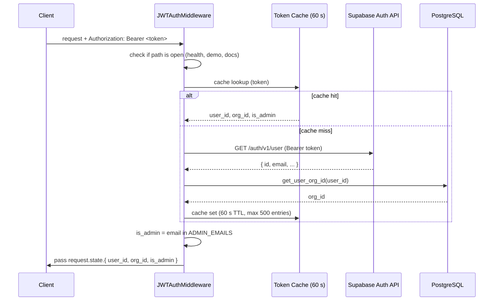

# Aethen-AI — Architecture

> This document describes the production architecture as it exists in the codebase. All diagrams reflect the actual implementation.

---

## Table of Contents

1. [High-Level Architecture](#1-high-level-architecture)
2. [LangGraph Pipeline — Three Compiled Graphs](#2-langgraph-pipeline)
3. [Request Lifecycle](#3-request-lifecycle)
4. [Data Flow — Ingestion to Analysis](#4-data-flow)
5. [Confidence Scoring System](#5-confidence-scoring)
6. [Authentication Flow](#6-authentication-flow)
7. [Data Store Responsibilities](#7-data-store-responsibilities)
8. [AI Orchestration](#8-ai-orchestration)
9. [Scalability Considerations](#9-scalability-considerations)
10. [Architecture Trade-offs](#10-trade-offs)

---

## 1. High-Level Architecture

```
┌─────────────────────────────────────────────────────────────┐
│  CLIENTS                                                    │
│  Browser ── Next.js App (Vercel)                            │
│  SDK      ── AethenClient (sdk/)                            │
│  MCP      ── MCP-compatible agent                           │
└───────────────────────┬─────────────────────────────────────┘
                        │ HTTPS
                        ▼
┌─────────────────────────────────────────────────────────────┐
│  FRONTEND BFF  (Next.js API Routes, Vercel)                 │
│  /api/cron/pull-langfuse  (daily, Vercel cron)              │
│  /api/cron/pull-langsmith (daily, Vercel cron)              │
│  /api/cron/digest         (07:00 UTC daily, Vercel cron)    │
│  All other routes proxy to → Python Backend                 │
└───────────────────────┬─────────────────────────────────────┘
                        │
                        ▼
┌─────────────────────────────────────────────────────────────┐
│  PYTHON BACKEND  (FastAPI, Render)                          │
│                                                             │
│  Middleware stack (applied in order):                       │
│   JWTAuthMiddleware → SecurityHeadersMiddleware →           │
│   BodySizeLimitMiddleware (1 MB) → RateLimitMiddleware →    │
│   CORSMiddleware                                            │
│                                                             │
│  23 routers: health, ingest, chat, sessions, stats,         │
│  langfuse, langsmith, demo, eval, qc, model-settings,       │
│  sources, llm-keys, api-key, profile, usage, admin,         │
│  onboarding, webhooks, digest, backfill, analyze-raw,       │
│  chat-sessions                                              │
└──────┬────────────────┬──────────────────────┬─────────────┘
       │                │                      │
       ▼                ▼                      ▼
  PostgreSQL /     Neo4j Aura          Langfuse / LangSmith
  pgvector         (graph)             (trace sources)
  (sessions +
   vectors)
```

---

## 2. LangGraph Pipeline

Three compiled `StateGraph` singletons exist in `backend/app/agents/graph.py`:

### 2.1 `analysis_graph` — Production Path

Used by: Chat Debug (`/api/chat`), Trace Explorer, LangSmith analysis, all production paths.



**Key optimisations:**
- All three nodes (`classify_intent`, `vector_retrieve`, `graph_traverse`) run in parallel from `parallel_start` — saves ~2 s vs sequential
- `graph_traverse` returns `[]` immediately when `AgentState["skip_graph"] = True` (no cross-session data needed) — saves ~3 s
- `fast_analyze` merges the separate analysis module + synthesize steps into one LLM call — saves ~8–12 s vs legacy pipeline

### 2.2 `fast_analysis_graph` — Demo Agent Only

Used by: `analyzeDirectly` endpoint (`/api/demo/analyze-direct`).



Skips Neo4j graph traversal entirely (single-session scope, cross-session value minimal).

### 2.3 `_legacy_analysis_graph` — Reference / Rollback

The original sequential pipeline with separate analysis modules and a final synthesize step. Not used in production. Rollback: change `analysis_graph = build_optimized_analysis_graph()` to `analysis_graph = _legacy_analysis_graph` in `graph.py`.

---

## 3. Request Lifecycle

### 3.1 Chat Debug (POST /api/chat)



### 3.2 Trace Ingestion (POST /api/ingest)



---

## 4. Data Flow

### 4.1 pgvector Schema

Trace events are embedded and stored in the `session_vectors` table:

```sql
CREATE TABLE session_vectors (
    id           TEXT PRIMARY KEY,          -- "{session_id}:{event_type}:{call_id}"
    session_id   TEXT NOT NULL,
    namespace    TEXT NOT NULL,             -- "traces" | "failure_patterns"
    org_id       UUID,                      -- tenant isolation
    event_type   TEXT,                      -- "llm_call" | "tool_call" | "retrieval" | "pattern"
    metadata     JSONB,
    embedding    vector(1536)               -- OpenAI text-embedding-3-small
);
CREATE INDEX ON session_vectors USING hnsw (embedding vector_cosine_ops);
```

**Text representations used for embedding:**
- LLM call: `"LLM call: {prompt[:500]} -> {response[:500]}"`
- Tool call: `"Tool call: {tool_name}({parameters}) -> {status}"`
- Retrieval: `"Retrieval: {query[:500]} -> {chunks_returned} chunks"`
- Failure pattern: rich summary including query, scores, errors, hallucinations

### 4.2 Neo4j Graph Schema

```
(Session) -[:CONTAINS_QUERY]->  (Query)
(Session) -[:FAILED_WITH]->     (FailureType)
(Session) -[:RELATED_TO]->      (Session)        ← shared failure type
(Session) -[:PRODUCED]->        (Response)
(Session) -[:USES]->            (PromptVersion)
(Query)   -[:RETRIEVED]->       (Chunk)
(Query)   -[:TRIGGERED]->       (ToolCall)
(Query)   -[:UNRESOLVED_DUE_TO]->(BlindSpot)
(ToolCall)-[:FAILED_WITH]->     (FailureEvent)
(Response)-[:CONTAINS]->        (FailureEvent)   ← hallucination
(Response)-[:INFLUENCED_BY]->   (Chunk)
```

8 node types: Session, Query, Chunk, ToolCall, Response, FailureEvent, BlindSpot, PromptVersion.

---

## 5. Confidence Scoring

`compute_confidence()` in `app/agents/nodes/confidence.py` produces deterministic scores — the LLM's self-reported confidence is only a ±0.075 secondary adjustment.

```
final_score = clamp(base_score + llm_adj, 0.05, 0.95)
llm_adj     = (llm_confidence - 0.5) × 0.15
```

**Signal weights by failure type:**

| Failure Type | Signal | Weight |
|---|---|---|
| `tool_misfire` | `failed_tool_call_status` | 0.45 |
| `tool_misfire` | `explicit_error_message` | 0.25 |
| `tool_misfire` | `timeout_latency_confirmed` | 0.10 |
| `tool_misfire` | `cascade_failures` | 0.10 |
| `memory` | `doc_id_full_miss` | 0.58 |
| `memory` | `doc_id_partial_mismatch` | 0.20–0.55 (scaled) |
| `memory` | `very_low_retrieval_scores` | 0.30 |
| `memory` | `low_retrieval_scores` | 0.20 |
| `hallucination` | `hallucination_flag` | 0.30–0.50 (scaled) |
| `hallucination` | `no_source_documents` | 0.15–0.30 (scaled) |
| `hallucination` | `relevant_docs_retrieved` | 0.15 |
| `blind_spot` | `zero_chunks_returned` | 0.50 |
| `blind_spot` | `all_scores_very_low` | 0.30 |
| `blind_spot` | `all_scores_low` | 0.15 |

---

## 6. Authentication Flow



**Public paths** (no JWT required): `/api/health`, `/api/demo/chat`, `/api/demo/scenarios`, `/api/demo/run`, `/api/demo/analyze-direct`, `/docs`, `/openapi.json`, `/redoc`.

---

## 7. Data Store Responsibilities

| Store | Owns | Does NOT own |
|---|---|---|
| **PostgreSQL** | Session JSON (`sessions` table), chat history (`chat_sessions` + `chat_messages`), app settings, per-org LLM keys (Fernet-encrypted), dashboard stats | Graph relationships |
| **pgvector** | Embedded trace events (`session_vectors`, `traces` + `failure_patterns` namespaces), similarity search | Raw session data |
| **Neo4j Aura** | Graph nodes + relationships, cross-session failure patterns, blind spot clusters | Raw session data, vectors |

---

## 8. AI Orchestration

### LLM Routing

All LLM factory functions live in `app/agents/llm.py`. Per-org credential override uses `contextvars.ContextVar` for coroutine-level isolation:

```python
set_org_llm_context(config)  # called once per request in route handler
# ... pipeline runs with org credentials injected
# contextvars clears automatically when coroutine completes
```

An in-memory model cache (`_model_cache`) is seeded from Postgres on startup and updated immediately when `POST /api/settings/models` is called. Default models:

| Role | Default Model |
|---|---|
| `analysis` | `gpt-4o-mini` |
| `synthesis` | `gpt-4o-mini` |
| `demo` | `gpt-4o-mini` |
| `anthropic` | `claude-sonnet-4-6` |

### Observability

- **Langfuse** — LangChain callback-based tracing; explicit `LangChainTracer` callbacks only (auto-tracing disabled via `LANGSMITH_TRACING=false` at startup)
- **LangSmith** — optional secondary tracing
- **Sentry** — FastAPI + Starlette integration, 10% traces sample rate, PII disabled (`send_default_pii=False`)

### Prompt Security

Every LLM-facing node applies `strip_injection(field, full_redact=True)` to free-text trace fields before embedding them in prompts. The `fast_analyze` system prompt includes an explicit security constraint instructing the model to treat all trace content as data.

---

## 9. Scalability Considerations

| Concern | Current approach | When to change |
|---|---|---|
| **pgvector performance** | Exact cosine search (HNSW index disabled at current data scale); `enable_indexscan=off` per transaction | Re-enable HNSW when `session_vectors` exceeds ~100K rows |
| **Neo4j connections** | `max_connection_lifetime=200s`, `liveness_check_timeout=2s`, `keep_alive=True` to survive Aura idle drops | Fine as-is for Aura free/starter tier |
| **Token cache** | In-memory dict, 500-entry LRU, 60 s TTL | Replace with Redis for multi-instance deployments |
| **Rate limiting** | In-memory middleware (100/min, 1 000/hr per IP) | Replace with Redis-backed sliding window for multi-instance |
| **LLM concurrency** | `asyncio.Semaphore(5)` in eval runner | Tune based on API tier limits |
| **Embedding** | OpenAI `text-embedding-3-small`, 1 536-dim | Upgrade dimension if accuracy demands it |

→ Full analysis: [docs/architecture/scalability.md](docs/architecture/scalability.md)

---

## 10. Trade-offs

| Decision | Why | Trade-off |
|---|---|---|
| **LangGraph over raw chains** | Deterministic state machine, typed `AgentState`, conditional routing, easy rollback | More setup overhead than a simple chain |
| **pgvector over Pinecone** | No external SaaS dependency, collocated with session data, lower latency for small-medium datasets | No managed index tuning; needs DBA attention at scale |
| **Neo4j for Graph RAG** | Cross-session blind spot detection requires graph traversal — vector search alone cannot find structural patterns | Adds connection complexity; graph_traverse is skipped (skip_graph=True) when not needed |
| **`fast_analyze` (1 LLM call)** | Reduces latency from ~25–30 s (legacy) to ~9–12 s; eval confirmed 100% accuracy maintained | Less explainable step separation; harder to debug individual pipeline stages |
| **Deterministic confidence** | Eliminates LLM overconfidence; scores are auditable and repeatable | Requires careful signal weight calibration; no access to agent KB means some heuristics are approximate |
| **Supabase Auth API verification** | Works for all sign-in methods (email, Google, GitHub) without JWT secret management | One external HTTP call per uncached token; mitigated by 60 s cache |
| **Render free tier** | Zero hosting cost | 30 s cold start after 15 min idle; not suitable for production SLA |
