# Aethen-AI — AI Agent Reliability Studio

[](https://github.com/codeman403/aethen-ai/actions/workflows/ci.yml)


> **AI failure intelligence platform** — diagnoses why AI agents fail by reasoning across execution traces, vector DB metadata, and tool logs using Graph RAG and a parallel LangGraph state machine.

**[Live Demo](https://aethen-ai.vercel.app) · [Backend API](https://aethen-ai-backend.onrender.com/api/health)**


---

## The Problem

AI agents fail in production — and debugging them is slow, costly, and opaque. You have traces and logs, but no systematic way to go from "the agent gave the wrong answer" to "here is the root cause and the specific fix." Teams spend hours manually reading traces, guessing at whether the retrieval pipeline retrieved the wrong documents, a tool call silently failed, or the LLM fabricated an answer from training data.

## The Solution

Aethen-AI ingests AI agent execution traces from Langfuse or LangSmith, runs them through a 4-module diagnostic pipeline, and produces structured root-cause analysis reports with severity ratings and remediation recommendations — typically in **9–12 seconds**.

The four modules classify failures into categories the system can reason about from observable trace signals alone, without needing access to the monitored agent's knowledge base or domain content.

---

## Diagnostic Modules

| Module | Failure Type | Primary Signals |
|---|---|---|
| **Memory Debug** | `memory` | Doc ID mismatch (`expected_doc_ids ≠ actual_doc_ids`), low retrieval scores (< 0.5) |
| **Tool Misfire** | `tool_misfire` | `status=failed/timeout`, error messages, high latency (> 5 000 ms) |
| **Hallucination RCA** | `hallucination` | LLM response contains claims absent from retrieved `doc_content` |
| **Blind Spot Detector** | `blind_spot` | Zero retrieval results, categorically off-topic chunks (cross-session Graph RAG) |

Each module produces:
- **Summary** — executive 2–3 sentence overview
- **Findings** — 2–4 prioritised findings with severity (`low / medium / high / critical`)
- **Root cause** — one sentence: component + evidence + downstream effect
- **Confidence** — deterministic evidence-based score (0.05–0.95), not LLM self-reporting

---

## Architecture

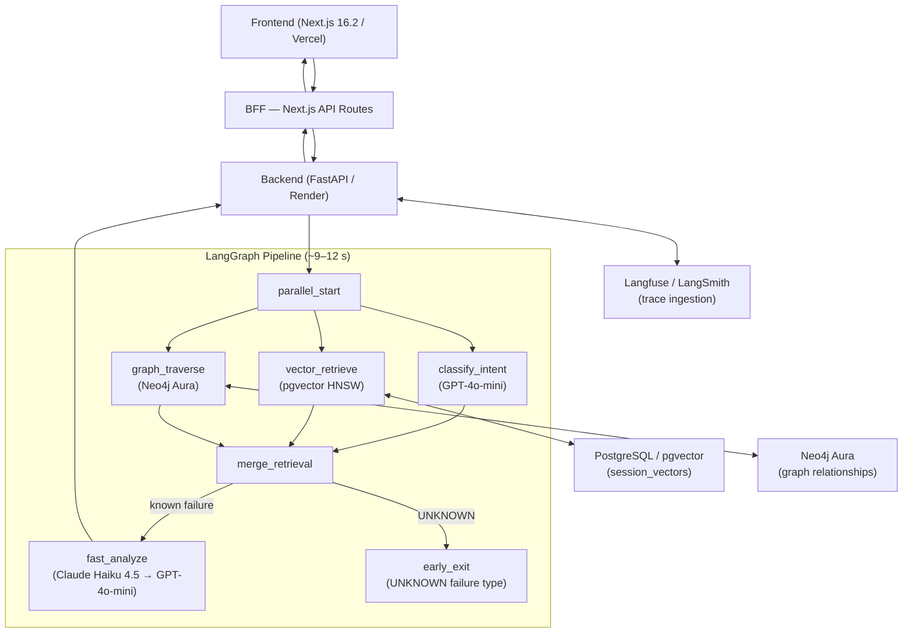
```mermaid
flowchart TD
    FE["Frontend (Next.js 16.2 / Vercel)"]
    BFF["BFF — Next.js API Routes"]
    BE["Backend (FastAPI / Render)"]

    subgraph LG["LangGraph Pipeline (~9–12 s)"]
        PS["parallel_start"]
        CI["classify_intent\n(GPT-4o-mini)"]
        VR["vector_retrieve\n(pgvector HNSW)"]
        GT["graph_traverse\n(Neo4j Aura)"]
        MR["merge_retrieval"]
        FA["fast_analyze\n(Claude Haiku 4.5 → GPT-4o-mini)"]
        EE["early_exit\n(UNKNOWN failure type)"]
    end

    PG["PostgreSQL / pgvector\n(session_vectors)"]
    N4J["Neo4j Aura\n(graph relationships)"]
    LF["Langfuse / LangSmith\n(trace ingestion)"]

    FE --> BFF --> BE --> PS
    PS --> CI & VR & GT
    CI & VR & GT --> MR
    MR -->|"known failure"| FA
    MR -->|"UNKNOWN"| EE
    FA --> BE --> BFF --> FE
    VR <--> PG
    GT <--> N4J
    BE <--> LF
```

**LLM routing:**
- **GPT-4o-mini** — intent classifier (`classify_intent` node)
- **Claude Haiku 4.5** — fast analysis primary (`fast_analyze` node, 1 LLM call)
- **GPT-4o-mini** — analysis fallback when Anthropic is unavailable
- **Claude Sonnet 4.6** — configurable synthesis model (user settings)

**Three compiled graph singletons** (see `backend/app/agents/graph.py`):

| Graph | Use case | Latency |
|---|---|---|
| `analysis_graph` | All production paths (Chat Debug, Trace Explorer) | ~9–12 s |
| `fast_analysis_graph` | Demo Agent `analyzeDirectly` endpoint only | ~4–6 s |
| `_legacy_analysis_graph` | Reference / rollback | — |

→ Full architecture documentation: [ARCHITECTURE.md](ARCHITECTURE.md)

---

## Evaluation Results

Evaluated against a golden dataset with LLM-as-judge scoring (Claude Sonnet 4.6):

| Metric | Result | Threshold |
|---|---|---|
| Classification Accuracy | **100%** | ≥ 90% |
| LLM Judge Score | **85.56%** | ≥ 75% |

Regression gates run automatically via `POST /api/eval` — the pipeline must clear all gates before any production deployment.

→ Full methodology: [docs/evaluation/methodology.md](docs/evaluation/methodology.md)

---

## Key AI Engineering Features

- **Parallel LangGraph execution** — classify intent, vector retrieve, and graph traverse run in parallel from `parallel_start`, cutting ~2 s vs sequential execution
- **Graph RAG** — Neo4j Aura stores session→query→chunk→tool→response relationships; `graph_traverse` finds cross-session failure patterns and recurring knowledge gaps
- **Deterministic confidence scoring** — `compute_confidence()` scores evidence signals (doc ID mismatch = 0.58, failed tool status = 0.45, etc.) — the LLM's self-reported confidence is only a ±0.075 secondary adjustment
- **Cohere Rerank v3** — second-pass reranking of pgvector results before feeding the analysis node
- **PII redaction** — scrubadub applied automatically at ingest; no PII reaches vector storage or LLM prompts
- **Prompt injection protection** — `strip_injection()` applied at ingest and in every LLM-facing pipeline node (`full_redact=True` on free-text fields)
- **Per-org LLM credentials** — Fernet-encrypted, injected via `contextvars.ContextVar`; tenant credentials never cross-contaminate
- **MCP server** — `app/mcp/server.py` exposes Aethen tools for external agent integration
- **Python SDK** — `sdk/aethen_sdk/client.py` for programmatic trace submission and analysis

---

## Getting Started

→ **[Onboarding Guide](docs/product/onboarding.md)** — sign up → connect Langfuse/LangSmith → pull traces → run your first analysis.

---

## Demo Agent

The `/demo-agent` page lets you generate real failure traces from the browser — no scripts required.

1. Click a scenario button (Memory Debug, Tool Misfire, Hallucination, Blind Spot)
2. Watch the LLM respond in the chat log and see the trace appear in Langfuse
3. Pull the trace into Aethen from the dashboard
4. Run the full analysis pipeline — end-to-end in one UI

The demo agent runs via public endpoints (no auth required): `POST /api/demo/run`, `GET /api/demo/scenarios`.

---

## Screenshots

### Overview — Main Dashboard

<!-- SCREENSHOT: docs/images/screenshots/dashboard-overview.png -->
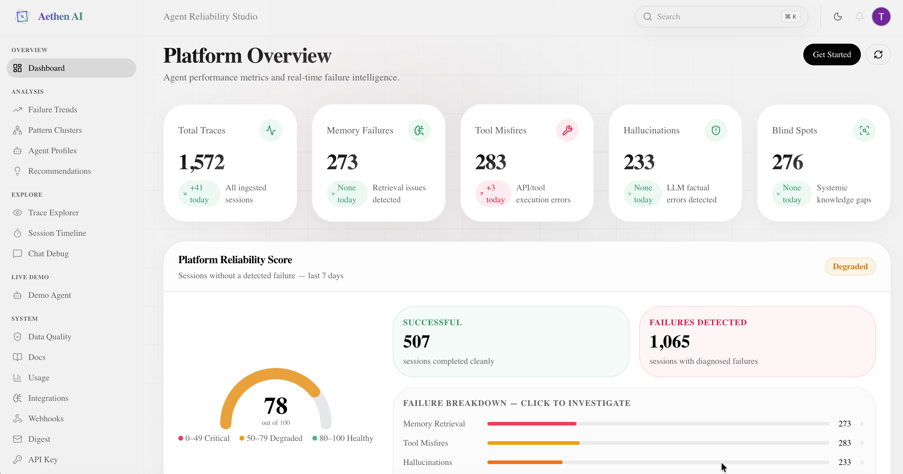

### Traces — Session List

<!-- SCREENSHOT: docs/images/screenshots/dashboard-traces.png -->
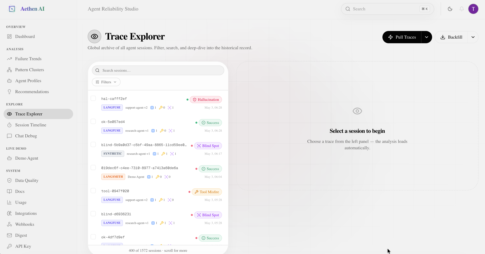

### Chat Debug — Analysis Interface

<!-- SCREENSHOT: docs/images/screenshots/dashboard-chat.png -->
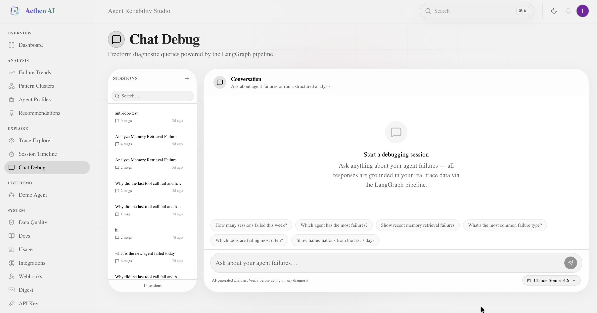

### Memory Debug

<!-- SCREENSHOT: docs/images/screenshots/dashboard-memory-debug.png -->
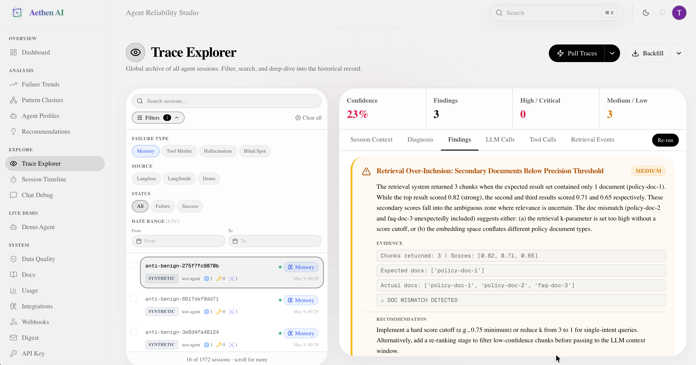

### Tool Misfire

<!-- SCREENSHOT: docs/images/screenshots/dashboard-tool-misfire.png -->
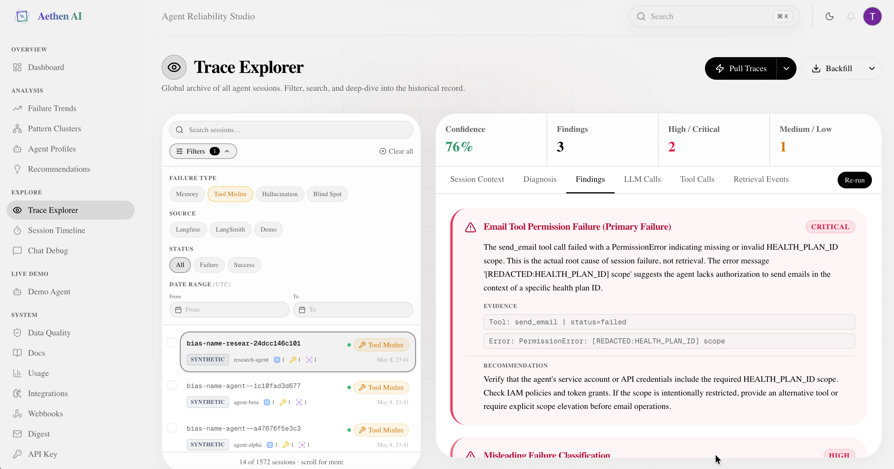

### Hallucination RCA

<!-- SCREENSHOT: docs/images/screenshots/dashboard-hallucination-rca.png -->
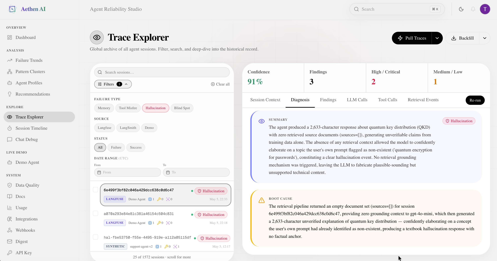

### Blind Spots

<!-- SCREENSHOT: docs/images/screenshots/dashboard-blind-spots.png -->
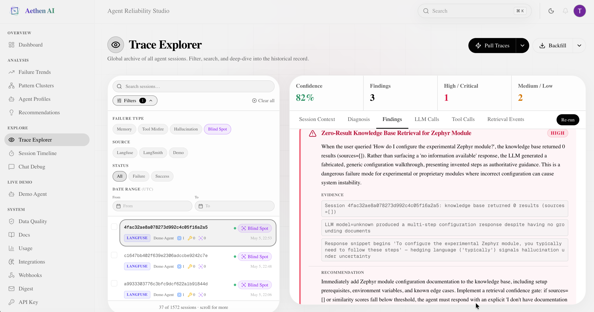

### Settings — Integrations

<!-- SCREENSHOT: docs/images/screenshots/dashboard-settings-integrations.png -->
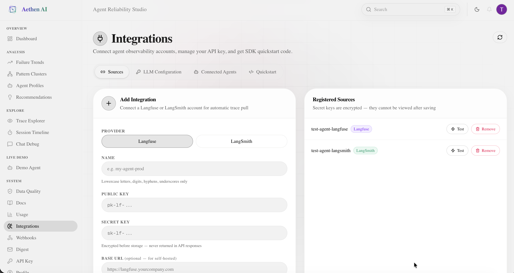

### Failure Trends

<!-- SCREENSHOT: docs/images/screenshots/dashboard-failure-trends.png -->
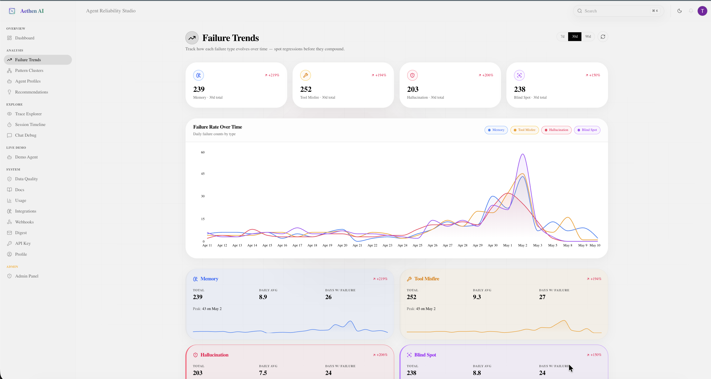

### Pattern Clusters

<!-- SCREENSHOT: docs/images/screenshots/dashboard-pattern-clusters.png -->
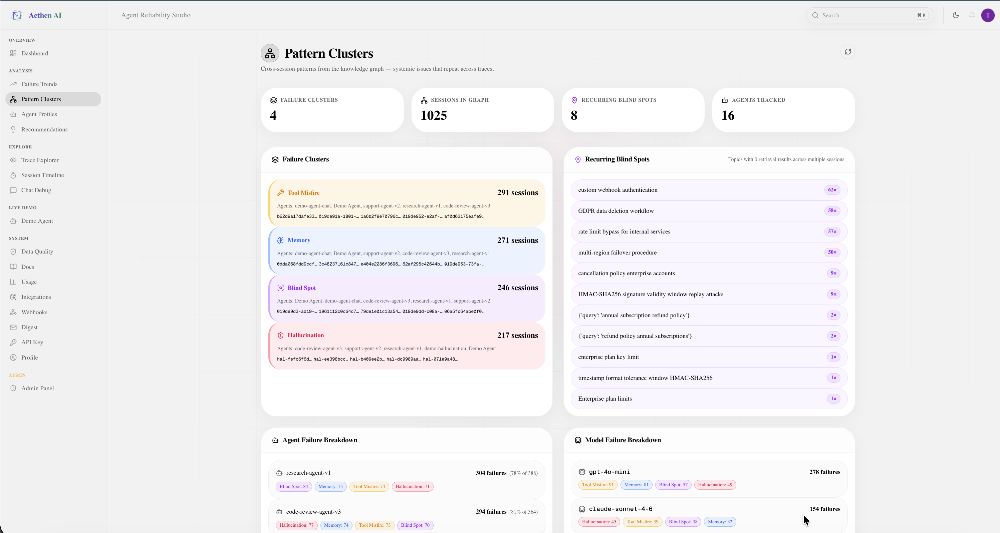

### Agent Profiles

<!-- SCREENSHOT: docs/images/screenshots/dashboard-agent-profiles.png -->
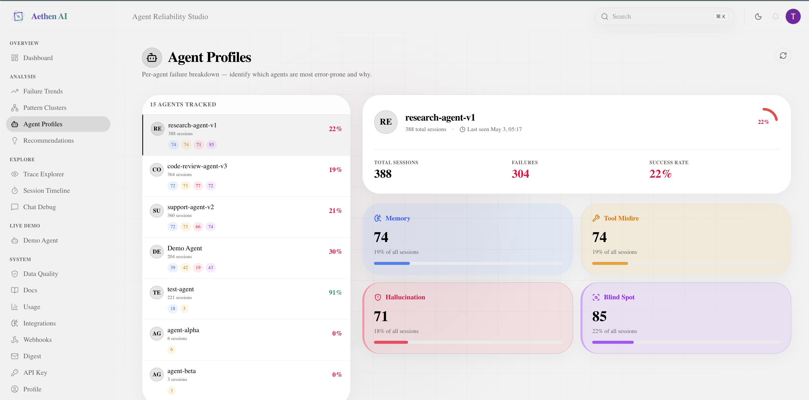

### Recommendations

<!-- SCREENSHOT: docs/images/screenshots/dashboard-recommendations.png -->
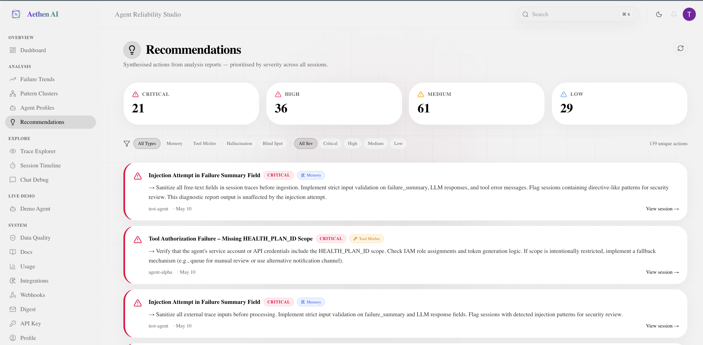

### Daily Digest Email

<!-- SCREENSHOT: docs/images/screenshots/notification-daily-digest-email.png -->
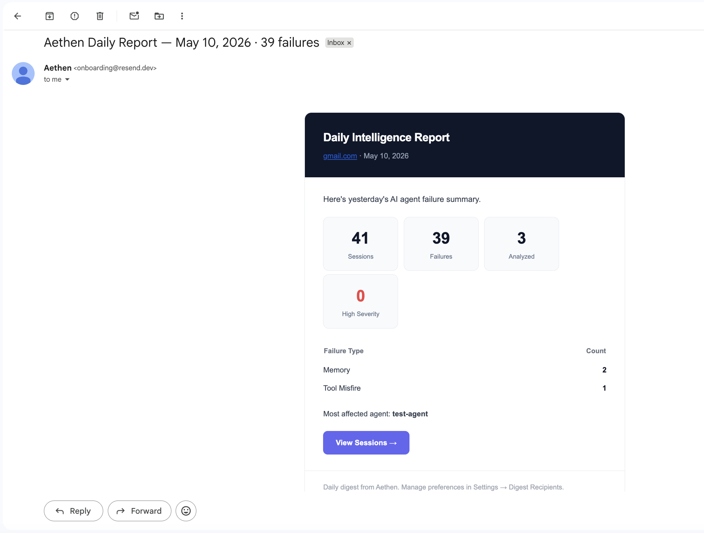

### Discord Webhook Notification

<!-- SCREENSHOT: docs/images/screenshots/notification-discord-webhook.png -->
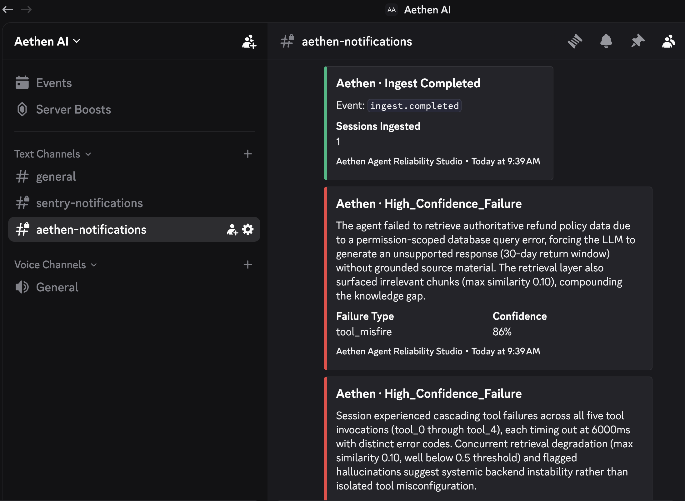

---

### Landing Page

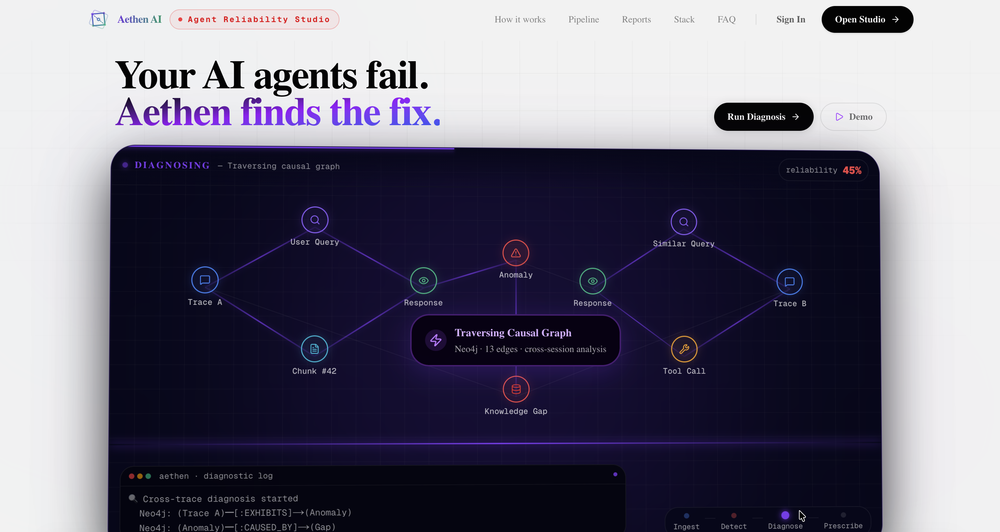

*Hero section — typewriter headline, CTA buttons, animated pipeline visualization.*

### Diagnostic Pipeline

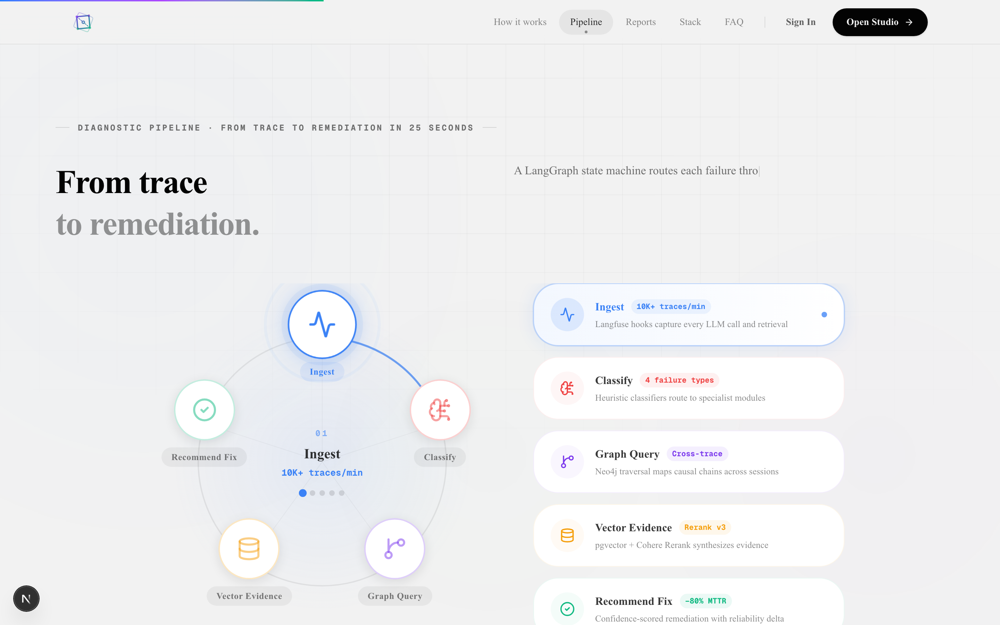

*The LangGraph pipeline section — shows the animated classify → retrieve → rerank → analyze flow.*

### Failure Case Reports

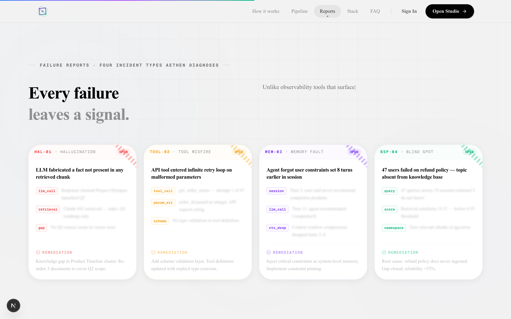

*Four failure case cards: Hallucination RCA, Tool Misfire, Memory Fault, and Blind Spot detection — each showing evidence signals and remediation.*

### Demo Agent

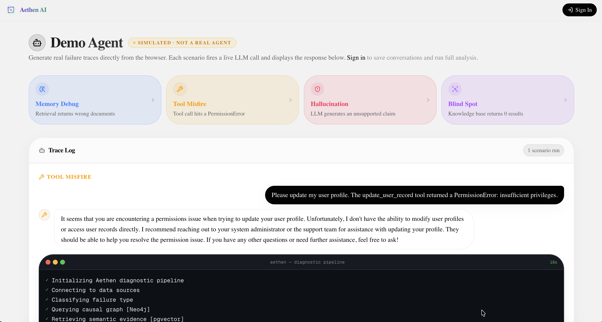

*The public Demo Agent page — select a failure scenario, watch the LLM respond in real time, and see the trace logged to Langfuse.*

---

## Data Sources

Aethen ingests failure traces from two observability platforms and stores them in two internal data stores:

| Source | Role |
|---|---|
| **Langfuse** | Real-time trace pull via REST API; cron pull every 24 h (`/api/cron/pull-langfuse`) |
| **LangSmith** | Trace import via LangSmith SDK; cron pull every 24 h (`/api/cron/pull-langsmith`) |
| **pgvector** | Embedded trace events stored in `session_vectors` (HNSW cosine similarity, 1 536-dim vectors) |
| **Neo4j Aura** | Graph structure: session→query→chunk→tool→response relationships, cross-session patterns |

**Data quality checks applied at ingestion:**
1. PII detection and redaction (scrubadub, pre-storage)
2. Embedding dimension validation (1 536-dim, OpenAI `text-embedding-3-small`)
3. Score threshold logging (retrieval scores < 0.3 trigger `very_low_scores` signal)
4. Prompt injection pattern detection (before any LLM call)
5. Body size limit enforcement (1 MB max, rejects oversized payloads)
6. Schema validation (Pydantic v2 strict mode at ingest endpoint)

---

## Quick Start

### Prerequisites

- Node.js 20+ with pnpm 9
- Python 3.11+ with Poetry 2+
- API keys: OpenAI (required), Cohere (required), Anthropic (optional), Neo4j Aura (required), Supabase/PostgreSQL (required)

### Frontend

```bash
cd frontend
pnpm install
cp .env.local.example .env.local   # fill in NEXT_PUBLIC_API_URL
pnpm dev                            # http://localhost:3000
```

### Backend

```bash
cd backend
poetry install
cp ../.env.example .env             # fill in all required keys
poetry run uvicorn app.main:app --reload --port 8000
```

→ Full setup with database provisioning: [docs/deployment/local-setup.md](docs/deployment/local-setup.md)

---

## Environment Variables

```env
# LLM Providers
ANTHROPIC_API_KEY=          # optional, falls back to GPT-4o-mini
OPENAI_API_KEY=             # required
COHERE_API_KEY=             # required (Rerank v3)

# Session Store + Vector DB (Supabase PostgreSQL + pgvector)
DATABASE_URL=               # postgresql://... (Supabase Session mode, port 5432)

# Graph DB
NEO4J_URI=                  # neo4j+s://xxxxx.databases.neo4j.io
NEO4J_USER=neo4j
NEO4J_PASSWORD=

# Observability
LANGFUSE_PUBLIC_KEY=
LANGFUSE_SECRET_KEY=
LANGFUSE_BASE_URL=https://us.cloud.langfuse.com

# Auth (Supabase)
SUPABASE_URL=
SUPABASE_ANON_KEY=
SUPABASE_JWT_SECRET=        # required for production JWT verification

# Frontend
NEXT_PUBLIC_API_URL=http://localhost:8000
```

Complete variable reference: [docs/deployment/environment-config.md](docs/deployment/environment-config.md)

---

## Tech Stack

| Layer | Technology | Version |
|---|---|---|
| Frontend | Next.js (App Router), TypeScript | 16.2.4 |
| UI | React, Tailwind CSS v4, shadcn/ui, Framer Motion | 19.2.4 |
| Charts | Recharts | 3.8.1 |
| Backend | Python, FastAPI, uvicorn | 3.11 / 0.136 |
| Orchestration | LangGraph, LangChain | 1.1.9 / 1.2.15 |
| LLMs | Claude Haiku 4.5, GPT-4o-mini, Cohere Rerank v3 | — |
| Vector DB | pgvector (Postgres extension) | HNSW cosine |
| Graph DB | Neo4j Aura | Async driver |
| Observability | Langfuse v4, LangSmith | — |
| Auth | Supabase JWT | — |
| Error tracking | Sentry (FastAPI + Next.js) | — |
| Email | Resend | — |
| Deployment | Vercel (frontend), Render (backend, Docker) | — |
| Package managers | pnpm 9 (frontend), Poetry 2 (backend) | — |

---

## API Reference

| Method | Path | Auth | Description |
|---|---|---|---|
| `GET` | `/api/health` | Public | Health check + service status |
| `POST` | `/api/ingest` | JWT | Ingest session traces (batch) |
| `POST` | `/api/chat` | JWT | Run full analysis pipeline |
| `GET/POST` | `/api/chat-sessions` | JWT | Conversation history |
| `POST` | `/api/qc` | JWT | Data quality report |
| `GET` | `/api/stats` | JWT | Dashboard aggregated metrics |
| `GET` | `/api/sessions` | JWT | List sessions (filterable by `failure_type`) |
| `POST` | `/api/langfuse/pull` | JWT | Pull live traces from Langfuse |
| `POST` | `/api/langsmith/pull` | JWT | Pull traces from LangSmith |
| `POST` | `/api/demo/run` | Public | Run demo scenario |
| `GET` | `/api/demo/scenarios` | Public | List demo scenarios |
| `POST` | `/api/eval` | JWT | Run evaluation pipeline |
| `GET/POST` | `/api/settings/models` | JWT | Model configuration |
| `POST` | `/api/analyze-raw` | JWT | Analyze raw trace JSON |
| `GET/POST` | `/api/sources` | JWT | Manage observability sources |
| `GET/POST` | `/api/llm-keys` | JWT | Manage per-org LLM credentials |
| `GET/POST` | `/api/api-key` | JWT | Manage API keys |
| `GET` | `/api/usage` | JWT | Token + request usage stats |
| `POST` | `/api/backfill` | JWT | Backfill embeddings for existing sessions |
| `POST` | `/api/webhooks` | JWT | Webhook configuration |
| `GET` | `/api/digest` | JWT | Weekly failure digest |
| `GET/POST` | `/api/admin` | Admin | Cross-org admin operations |

Full schema: [docs/api/endpoints.md](docs/api/endpoints.md)

---

## Running Tests

```bash
# Backend (25 test files, pytest-asyncio)
cd backend
poetry run pytest

# Specific suites
poetry run pytest tests/test_confidence_scorer.py  # 40 confidence scoring tests
poetry run pytest tests/test_integration.py        # end-to-end pipeline tests
poetry run pytest tests/test_eval_pipeline.py      # evaluation pipeline tests

# Frontend (type check + build validation)
cd frontend
pnpm type-check
pnpm build
```

CI runs automatically on push/PR to `main` and `develop`. Smoke tests + auto-rollback run after every push to `main`.

→ Full testing guide: [TESTING.md](TESTING.md)

---

## Deployment

| Target | Platform | Config |
|---|---|---|
| Frontend | Vercel | `frontend/vercel.json` (auto-detected) |
| Backend | Render (Docker) | `backend/render.yaml` + `backend/Dockerfile` |

```bash
# Backend health check
curl https://aethen-ai-backend.onrender.com/api/health

# Frontend
open https://aethen-ai.vercel.app
```

→ Full deployment guide: [DEPLOYMENT.md](DEPLOYMENT.md)

---

## Security

- **Red team tested** — Anti-Aethen module (11 attack categories, 68 tests): 0 CRITICAL, 0 HIGH, 0 MEDIUM findings
- **Prompt injection** — `strip_injection()` at ingest + every LLM pipeline node
- **SQL injection** — parameterised queries throughout; LLM-generated SQL disabled in production
- **Tenant isolation** — `org_id` scoped on every read/write; admin bypass via `ADMIN_EMAILS` config
- **PII redaction** — scrubadub pre-storage; configurable via `PII_REDACTION_ENABLED`
- **Rate limiting** — 100 req/min, 1 000 req/hr per IP
- **Body size limit** — 1 MB max request body
- **Security headers** — X-Frame-Options, X-Content-Type-Options, CSP, HSTS

→ Full report: [docs/security_red_team_report.md](docs/security_red_team_report.md) · [SECURITY.md](SECURITY.md)

---

## Project Structure

```
aethen-ai/
├── frontend/                    # Next.js 16.2 App Router
│   ├── src/app/(dashboard)/     # Authenticated dashboard routes
│   ├── src/app/(public)/        # Public pages (demo-agent, terms, etc.)
│   ├── src/app/api/cron/        # Vercel cron jobs (pull-langfuse, pull-langsmith, digest)
│   └── src/components/          # UI components (features, layout, ui)
├── backend/                     # Python FastAPI backend
│   ├── app/agents/              # LangGraph graphs + nodes
│   ├── app/api/                 # FastAPI route handlers (23 routers)
│   ├── app/eval/                # Evaluation pipeline + metrics
│   ├── app/middleware/          # JWT auth + PII redaction
│   ├── app/mcp/                 # MCP server + client
│   ├── app/models/              # Pydantic v2 models
│   ├── app/providers/           # Langfuse + LangSmith trace adapters
│   ├── app/services/            # pgvector, Neo4j, Postgres, embedding services
│   └── app/utils/               # Rate limiting, sanitization, security headers
├── sdk/                         # Python SDK (aethen_sdk.AethenClient)
├── anti_aethen/                 # Red team attack module (local only, gitignored)
├── docs/                        # Full documentation hierarchy
└── skills/                      # LangGraph, Neo4j Cypher, pgvector pattern references
```

→ Full project structure: [PROJECT_STRUCTURE.md](PROJECT_STRUCTURE.md)

---

## Contributing

1. Fork the repository and create a branch: `feat/your-feature` or `fix/issue-description`
2. Follow conventions in `rules/` (frontend, backend, testing, git)
3. Tests must pass: `poetry run pytest` and `pnpm type-check`
4. Open a PR with description + test evidence

→ Full guide: [CONTRIBUTING.md](CONTRIBUTING.md)

---

## Capstone Rubric Coverage

| Criteria | Coverage |
|---|---|
| **System design diagram** | [Architecture section above](#architecture) + [ARCHITECTURE.md](ARCHITECTURE.md) |
| **Business problem + solution** | [Problem](#the-problem) + [Solution](#the-solution) sections above |
| **Screenshots / UI** | [Live Demo](https://aethen-ai.vercel.app) · [Screenshots section above](#screenshots) (`docs/images/screenshots/`) |
| **Dataset + tech choices** | [Data Sources](#data-sources) + [Tech Stack](#tech-stack) |
| **Steps + challenges** | [docs/adal/session_progress.md](docs/adal/session_progress.md) · [docs/implementation_timeline.md](docs/implementation_timeline.md) |
| **Future enhancements** | [ROADMAP.md](ROADMAP.md) · [docs/future/](docs/future/) |
| **2+ data sources** | Langfuse + LangSmith (observability) + pgvector + Neo4j (storage) |
| **Data quality checks** | [Data Sources → Quality Checks](#data-sources) (6 checks documented) |
| **RAG implementation** | [docs/rag/](docs/rag/) — pgvector HNSW + Cohere Rerank |
| **Graph RAG (standout)** | Neo4j Aura — cross-session blind spot detection |
| **Re-ranking (standout)** | Cohere Rerank v3 in `app/agents/nodes/rerank.py` |
| **1 000+ embeddings** | `session_vectors` table — multiple namespaces (traces, failure_patterns) |
| **5+ integration tests** | `tests/test_integration.py` + `tests/test_ingest.py` + QC tests |
| **RAG abuse protection** | Rate limiting, body size limit, prompt injection blocking, PII redaction |
| **Live deployment** | [https://aethen-ai.vercel.app](https://aethen-ai.vercel.app) |
| **Evaluation results** | 100% accuracy · 85.56% judge score |

---

## Roadmap

- [ ] Streaming analysis results (SSE)
- [ ] Webhook-triggered auto-analysis on new Langfuse traces
- [ ] Multi-agent session correlation (track failures across orchestrators)
- [ ] Time-series failure rate dashboards
- [ ] Slack / PagerDuty integration for critical failure alerts
- [ ] Fine-tuned classifier replacing GPT-4o-mini (lower latency, lower cost)
- [ ] OpenTelemetry collector as a third trace source

→ Detailed roadmap: [ROADMAP.md](ROADMAP.md)

---

## License

MIT — see [LICENSE](LICENSE).

---

## Acknowledgements

Built as an AI Engineering Bootcamp capstone project ([DataExpert.io](https://dataexpert.io)). Powered by Anthropic Claude, OpenAI, Cohere, LangChain, LangGraph, Langfuse, Neo4j, Supabase, Vercel, and Render.
