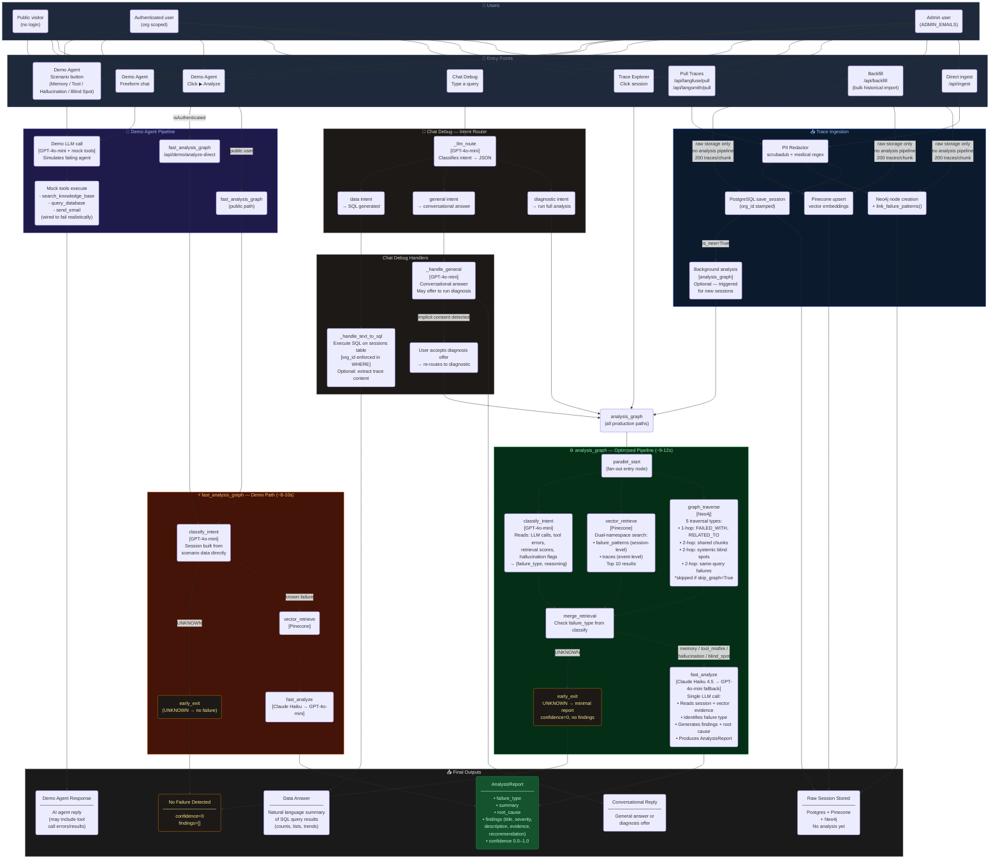

# Aethen-AI — 360° System Flow Diagram

> Complete prompt-to-output flow for every route Aethen can take.
> Covers all user types, entry points, pipeline branches, and output forms.

---

## Full System Flow



---

## Route Summary Table

| Trigger | Auth Required | Pipeline | Avg Latency | Output |
|---------|--------------|----------|-------------|--------|
| Demo scenario button click | None | Demo LLM + mock tools | ~2-4s | Agent chat response |
| Demo freeform chat | None | Demo LLM + mock tools | ~2-4s | Agent chat response |
| Demo → Analyze (any user) | None | `fast_analysis_graph` | ~8-10s | AnalysisReport |
| Chat Debug — counting/filtering query | Auth | SQL intent → text-to-SQL → Postgres | ~3-6s | Data answer |
| Chat Debug — "what is X?" question | Auth | General intent → LLM | ~2-3s | Conversational reply |
| Chat Debug — "diagnose this session" | Auth | Diagnostic intent → `analysis_graph` | ~9-12s | AnalysisReport |
| Trace Explorer — click session | Auth | `analysis_graph` | ~9-12s | AnalysisReport |
| Pull Traces (Langfuse/LangSmith) | Auth | Ingest → Postgres/Pinecone/Neo4j → optional background analysis | ~5-30s | Sessions stored |
| Backfill (bulk historical) | Auth | Raw storage only, 200/chunk, background | minutes–hours | Sessions stored (no analysis) |
| Direct ingest API | Auth | Ingest → Postgres/Pinecone/Neo4j | ~1-2s/session | Session stored |

---

## Classification Branch Decision Tree

```
classify_intent reads:
  ├── LLM calls        → hallucination_flag, source_documents, response
  ├── Tool calls       → status (failed/timeout), error message, latency
  ├── Retrieval events → relevance_scores, expected vs actual doc IDs, chunks_returned
  └── Failure summary  → pre-set label (hint only — LLM may override)

Result:
  ├── memory       → low similarity scores (<0.5), doc ID mismatch, stale embeddings
  ├── tool_misfire → failed/timeout tool call, permission error, bad parameters
  ├── hallucination→ LLM response contradicts source docs, claims without grounding
  ├── blind_spot   → zero retrieval results, topic absent from knowledge base
  └── unknown      → no clear signals → early_exit (no analysis, ~2s total)
```

---

## Key Architectural Rules

1. **`get_data_org_id(request)`** is called at the top of every data route handler. Returns `None` for admin (no filter), org UUID for regular users, sentinel UUID `00000000-...` for users with no org yet.

2. **`set_org_llm_context(config)`** is called before every `analysis_graph.ainvoke()`. Threads per-org LLM credentials through LangGraph via `contextvars.ContextVar`.

3. **Early exit** fires in both graphs when `failure_type == UNKNOWN`. In `fast_analysis_graph`, it saves the entire vector retrieve + analyze steps. In `analysis_graph`, retrieval has already started in parallel (trade-off for the ~2s parallelism gain on real failures).

4. **`skip_graph=True`** in initial state causes `graph_traverse` to return `[]` immediately. Callers set this when the org has no cross-session Neo4j data (avoids ~3s Neo4j connection overhead).

5. **Backfill never runs LangGraph**. It stores raw sessions at maximum speed. Users run diagnosis on demand later from Trace Explorer.
