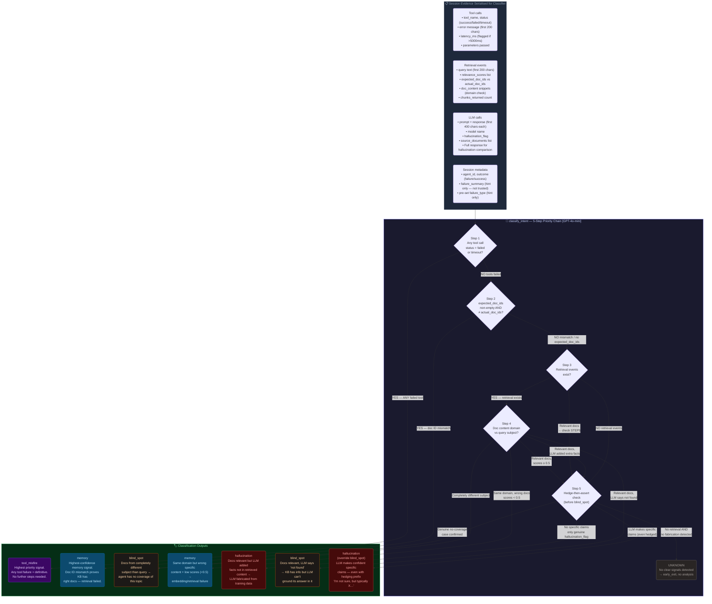
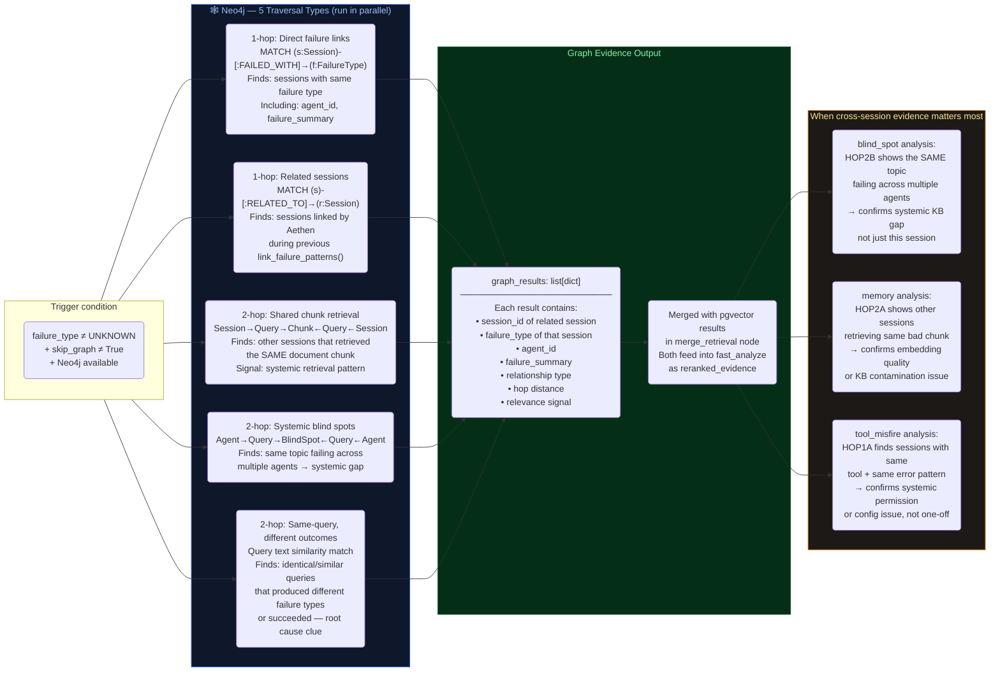
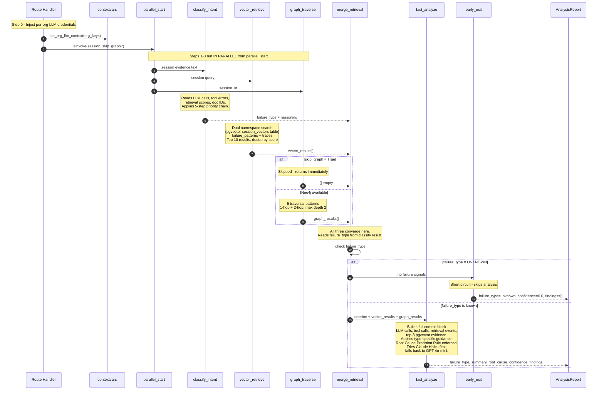

# Aethen-AI — Internal Mechanics Flow Diagram

> Deep-dive into how Aethen classifies failures, gathers cross-session evidence,
> analyses each failure type, and synthesises the final diagnostic report.
> Companion to `aethen_flow_360.md` (entry points & routing).

---

## Part 1 — Classification: How Failure Type Is Determined



### Key architectural constraint: Aethen reads traces, not the agent's KB

Aethen **never accesses the agent's knowledge base, embedding model, or domain content**. Every classification decision is made entirely from observable signals in the execution trace.

| Signal | What Aethen knows | What it doesn't know |
|--------|-------------------|---------------------|
| `relevance_scores = [0.28, 0.31]` | Retrieval returned low-confidence results | Whether those docs were actually wrong for this domain |
| `expected_doc_ids ≠ actual_doc_ids` | Agent expected specific docs, got different ones | Why the expected docs weren't returned |
| `tool_call.status = "failed"` | Tool execution failed | What the tool was supposed to do |
| `chunks_returned = 0` | Nothing in the KB matched | Whether the topic is legitimately out of scope |
| LLM response not in `doc_content` | Possible hallucination | Whether the LLM was correct from training data |

**The `expected_doc_ids` field is the critical bridge.** When agent developers populate it with what documents *should* have been retrieved, Aethen's memory classification shifts from heuristic (score thresholds) to ground-truth comparison (doc ID mismatch = definitive signal, weight 0.58). Without it, classification accuracy degrades.

**Score thresholds are universal, not domain-specific.** A medical agent's cosine similarity of 0.45 might be fine for specialised terminology; a general agent's 0.6 might still be wrong. Aethen applies the same 0.5 threshold to all domains — a known limitation.

**Aethen is a signal amplifier, not a domain expert.** It surfaces suspicious patterns for human investigation. Lower confidence scores (< 0.5) mean "investigate this" — not "this is definitively broken."

---

## Part 2 — Cross-Session Evidence: How Neo4j Graph Traversal Works



---

## Part 3 — Analysis & Synthesis per Failure Type

### How `fast_analyze` handles all 4 types in one LLM call

```mermaid
flowchart TD
    subgraph EVIDENCE_IN["📥 Evidence into fast_analyze"]
        FE1("Session metadata\nagent_id, outcome, failure_type hint")
        FE2("LLM calls\nprompt + response (400 chars each)\nhallucination_flag, source_documents")
        FE3("Tool calls\nstatus, error message, latency\nparameters passed")
        FE4("Retrieval events\nquery, scores, expected vs actual doc IDs\ndoc_content snippets")
        FE5("Vector evidence\nTop-3 pgvector results\nscore + content snippet (300 chars)\nSimilar failure patterns from KB")
    end

    subgraph LLM_CALL["🤖 fast_analyze — Single LLM Call\n[Claude Haiku 4.5 → GPT-4o-mini fallback]"]
        PROMPT_RULES("Prompt encodes 4 type-specific guidance blocks\n+ Root Cause Precision Rule:\n  (1) Component/mechanism that failed\n  (2) Measurable evidence (score/error/latency/doc ID)\n  (3) Downstream effect on agent response")
    end

    subgraph BRANCHES["Analysis per failure_type"]
        direction TB

        subgraph MEM_ANALYSIS["🔵 memory — Retrieval Failure"]
            MA1("Examines:\n• relevance_scores — are they < 0.5?\n• expected_doc_ids vs actual_doc_ids\n• doc_content domain match to query\n• Embedding quality signals")
            MA2("Checks:\n• Did retrieval return wrong docs?\n• Are scores consistently low?\n• Was KB contaminated with wrong content?\n• Is index stale / not updated?")
            MA3("Root cause template:\n'Embedding similarity peaked at [score] — below [threshold] — causing\nretrieval to surface [wrong doc type] instead of [expected docs],\nso LLM answered with [incorrect info].'")
        end

        subgraph TOOL_ANALYSIS["🟣 tool_misfire — Tool Execution Failure"]
            TA1("Examines:\n• Tool call status (failed/timeout)\n• Error message content\n• Latency (>5000ms = timeout signal)\n• Parameters passed\n• Cascade: did one tool failure cause others?")
            TA2("Checks:\n• Permission error? → missing OAuth scope\n• Timeout? → service down or too slow\n• Wrong params? → agent config issue\n• Repeated loops? → retry without fix")
            TA3("Root cause template:\n'[tool_name] returned [error_type] error at [latency]ms,\nindicating [permission gap / service timeout / param mismatch],\ncausing agent to [loop / return error / abandon task].'")
        end

        subgraph HALL_ANALYSIS["🔴 hallucination — Fabricated Claims"]
            HA1("Pre-analysis heuristics (before LLM call):\n1. Grounding without sources check\n   LLM says 'based on docs' but no docs provided\n2. Response/context ratio check\n   LLM response much longer than retrieved content\n3. Hedge-then-assert detection\n   'I'm not sure, but typically X...' — X is fabricated\n4. Contradiction check\n   Response contradicts doc_content directly")
            HA2("LLM analysis examines:\n• Source documents vs response claims\n• hallucination_flag=True signals\n• Confidence calibration\n• Fabricated references / citations\n• Stale sources causing wrong 'facts'")
            HA3("Root cause template:\n'LLM generated [specific claim] without grounding — [retrieved docs]\ncovered [actual topic] but not [claimed topic], and response\ncontained [X] assertions unsupported by source documents.'")
        end

        subgraph BS_ANALYSIS["🟠 blind_spot — Knowledge Gap"]
            BSA1("Examines:\n• chunks_returned = 0 → complete gap\n• Retrieval scores all < 0.3 → off-topic results\n• Query topic vs KB coverage\n• Neo4j: same topic failing across multiple agents\n• Agent says 'I don't have information'")
            BSA2("Checks:\n• Is topic completely absent from KB?\n• Is agent domain restricted?\n• Did LLM hedge correctly vs hallucinate?\n• Cross-agent pattern (systemic vs one-off)\n• Tool coverage gap (no tool for this task)")
            BSA3("Root cause template:\n'Vector search returned [0/N off-topic] chunks for query [topic],\nconfirming [topic] is absent from the knowledge base —\nagent correctly stated [no info] but [could not complete task].'")
        end
    end

    subgraph REPORT_BUILD["📊 AnalysisReport Construction"]
        RF1("failure_type\n(refined from LLM — may differ from hint)")
        RF2("summary\n2-3 sentence executive summary")
        RF3("root_cause\nONE precise sentence:\ncomponent + evidence + downstream effect")
        RF4("confidence: 0.0–1.0\nRule-based scorer — compute_confidence()\nin app/agents/nodes/confidence.py\n\nDETERMINISTIC signal weights:\n• tool_misfire: failed_status(0.45) +\n  error_msg(0.25) + timeout(0.10)\n• memory: doc_id_full_miss(0.58) or\n  partial_mismatch(scaled) or\n  score thresholds(0.20-0.30)\n• hallucination: flag × proportion\n  (0.30-0.50) + no_sources(0.15-0.30)\n• blind_spot: zero_chunks(0.50) or\n  very_low_scores(0.30)\n\nLLM raw score: secondary ±0.075 only\nFinal: clamp(base + adj, 0.05, 0.95)")
        RF5("findings[]: 2-4 items\nEach:\n• title (short headline)\n• severity (low/medium/high/critical)\n• description (detailed with evidence)\n• evidence (quoted strings from trace)\n• recommendation (specific fix action)")
    end

    EVIDENCE_IN --> LLM_CALL
    LLM_CALL --> PROMPT_RULES
    PROMPT_RULES --> MEM_ANALYSIS & TOOL_ANALYSIS & HALL_ANALYSIS & BS_ANALYSIS
    MEM_ANALYSIS & TOOL_ANALYSIS & HALL_ANALYSIS & BS_ANALYSIS --> REPORT_BUILD

    style EVIDENCE_IN    fill:#1e293b,color:#94a3b8,stroke:#475569
    style LLM_CALL       fill:#1a1a2e,color:#c7d2fe,stroke:#4f46e5
    style MEM_ANALYSIS   fill:#0c4a6e,color:#bae6fd,stroke:#0284c7
    style TOOL_ANALYSIS  fill:#3b0764,color:#e9d5ff,stroke:#7c3aed
    style HALL_ANALYSIS  fill:#450a0a,color:#fca5a5,stroke:#ef4444
    style BS_ANALYSIS    fill:#431407,color:#fed7aa,stroke:#ea580c
    style REPORT_BUILD   fill:#052e16,color:#86efac,stroke:#16a34a
    style BRANCHES       fill:#0f0f0f,color:#e5e5e5,stroke:#404040
```



---

## Part 4 — Full Internal Sequence (All Steps Combined)



---

## Part 5 — Root Cause Precision Rule (How Root Causes Are Structured)

Every `root_cause` string must satisfy exactly three requirements in one sentence:

```
┌─────────────────────────────────────────────────────────────────────────────┐
│                    ROOT CAUSE = (1) + (2) + (3)                             │
├─────────────────────────────────────────────────────────────────────────────┤
│ (1) The specific component or mechanism that failed                          │
│     → "Embedding similarity", "OAuth scope for send_email",                 │
│       "vector index for API rate limit docs", "tool timeout threshold"       │
│                                                                              │
│ (2) The measurable evidence confirming it                                    │
│     → score value, error message, latency in ms, doc ID mismatch,           │
│       hallucination_flag=True, chunks_returned=0                             │
│                                                                              │
│ (3) The downstream effect on the agent response                             │
│     → what the agent actually said/did wrong as a result                     │
└─────────────────────────────────────────────────────────────────────────────┘

✅ GOOD: "Embedding similarity peaked at 0.38 — below the 0.5 threshold —
         causing retrieval to surface billing policy docs instead of the
         expected API rate limit documentation, so the LLM answered with
         stale pricing data from 2023."

❌ BAD:  "The retrieval system returned incorrect documents."
❌ BAD:  "The tool call failed due to an error."
❌ BAD:  "The LLM hallucinated information."
```

---

## Part 6 — Confidence Score Assignment Logic

**The confidence score is LLM-determined, not rule-based.**

The prompt instructs the LLM: *"confidence: 0.0–1.0"* — and the LLM reads all
the evidence and picks a number based on how strongly the signals support its diagnosis.
There are no backend thresholds or rules that set specific values.

```python
# backend code — fast_analyze.py
confidence = float(parsed.get("confidence", 0.5))  # 0.5 fallback if LLM omits it

# Hardcoded exceptions (backend enforced, not LLM):
#   early_exit (UNKNOWN, no signals)  → 0.0
#   UNKNOWN path in fast_analyze      → 0.0
#   "no failure detected" (synthesize)→ 1.0  (legacy pipeline only)
#   JSON parse failure fallback        → 0.5
```

**What the LLM tends to produce** (observed behaviour, not enforced):

| Evidence quality | Typical LLM output |
|-----------------|-------------------|
| Explicit tool error message + stack trace | 0.85 – 0.95 |
| Doc ID mismatch (expected_doc_ids ≠ actual) | 0.80 – 0.92 |
| `hallucination_flag = True` in trace | 0.75 – 0.90 |
| `chunks_returned = 0` (blind spot confirmed) | 0.70 – 0.88 |
| Low retrieval scores < 0.5 (no doc IDs) | 0.55 – 0.75 |
| Inferred from response pattern alone | 0.40 – 0.65 |
| Weak or conflicting signals | 0.25 – 0.50 |
| No signals found | 0.00 (early_exit fires before LLM call) |

**Production-grade caveat**: The rule-based scorer is deterministic and evidence-driven —
a major improvement over LLM self-reporting. However, the weights (0.45, 0.55, etc.)
are domain heuristics, not learned from data. True production calibration requires:
1. Collect 500+ sessions with outcome labels (was the diagnosis correct?)
2. Fit logistic regression on signal weights using that data
3. Apply Platt scaling to map scores → true probabilities
4. Add a feedback endpoint (user marks diagnosis right/wrong)
5. Retrain quarterly

Current system is **production-safe** for a capstone/demo where confidence informs
but doesn't drive automated decisions. Not yet production-safe for SLA triggers or
auto-remediation.

**What's fully production-grade now:**
- Deterministic ✅ · Explainable (breakdown log) ✅ · Evidence-based ✅ · Tested (40 unit tests) ✅

---

## Part 7 — Finding Severity Assignment Logic

```
critical  → Agent completely failed the task AND caused data corruption
            or cascading failures (e.g. tool loop destroying state)

high      → Agent returned wrong answer with confidence, or primary task
            failed (e.g. doc mismatch on main query, tool permission denied)

medium    → Agent partially answered or hedged correctly but core capability
            is degraded (e.g. retrieved 3/5 right docs, 2 wrong)

low       → Minor quality issue, edge case, or degraded performance within
            acceptable bounds (e.g. slight score drop, minor phrasing issue)
```
