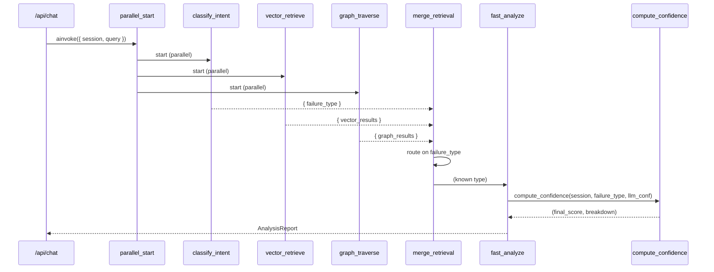
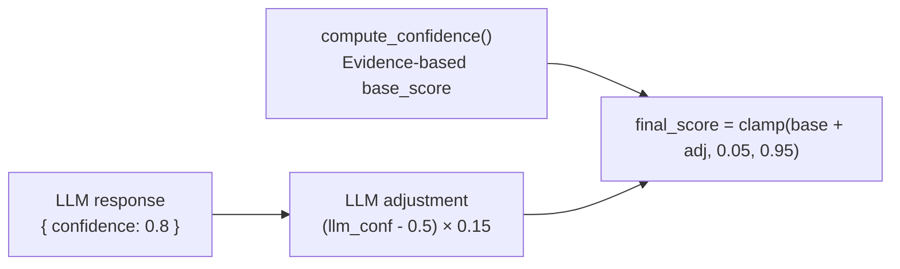
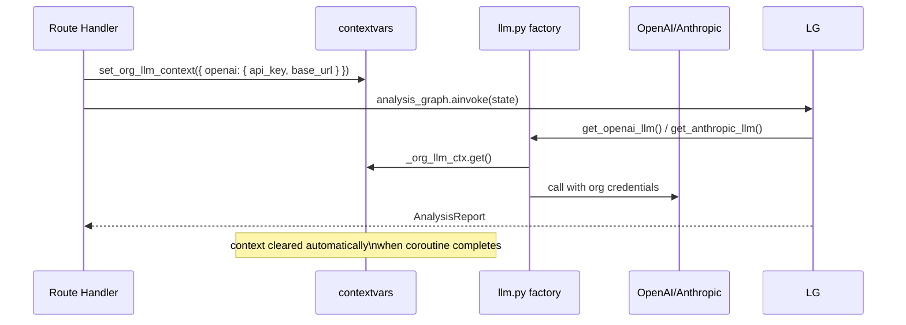

# Agentic Workflows

---

## Production Pipeline — `analysis_graph`

The production pipeline uses a parallel fan-out pattern to minimise latency:



All three parallel nodes (`classify_intent`, `vector_retrieve`, `graph_traverse`) start simultaneously. The first to complete writes its partial state update; `merge_retrieval` fires when all three have written their keys.

### Early Exit

When `classify_intent` returns `UNKNOWN`, `merge_retrieval` routes to `early_exit` instead of `fast_analyze`. The other two nodes may still be running — LangGraph handles the state merge gracefully and the early exit node fires once merge completes.

---

## Intent Classification — 5-Step Decision Chain

`classify_intent` (GPT-4o-mini) applies a deterministic 5-step priority chain:

```
Step 1: Any tool call status=failed/timeout? → tool_misfire (done, no further steps)
Step 2: expected_doc_ids ≠ actual_doc_ids? → memory (definitive signal)
Step 3: No retrieval events? → go to Step 5
Step 4: Retrieval events exist:
  - Categorically different subject (billing → API) → blind_spot
  - Same domain, low scores (<0.5) → memory
  - Relevant docs, LLM adds specific claims → hallucination
  - Relevant docs, LLM says "not found" → blind_spot
Step 5: Hedge-then-assert check:
  - LLM makes specific claims (even after hedging) → hallucination
  - No fabrication detected → unknown (early exit)
```

**Critical rule:** When `expected_doc_ids` is provided and differs from `actual_doc_ids`, classify `memory` immediately. The KB has the right docs — the retrieval system fetched the wrong ones.

---

## Graph RAG — Blind Spot Detection

Neo4j enables cross-session blind spot detection that vector search alone cannot provide.

### Graph Schema Used for Blind Spot Detection

```cypher
// Find sessions with the same failure type
MATCH (s:Session)-[:FAILED_WITH]->(ft:FailureType {name: $failure_type})
RETURN s.session_id, s.agent_id

// Find recurring blind spot topics
MATCH (q:Query)-[:UNRESOLVED_DUE_TO]->(bs:BlindSpot)
RETURN bs.topic, COUNT(q) as frequency
ORDER BY frequency DESC

// Find sessions sharing a failure event
MATCH (s1:Session)-[:PRODUCED]->(r1:Response)-[:CONTAINS]->(fe:FailureEvent)
MATCH (s2:Session)-[:PRODUCED]->(r2:Response)-[:CONTAINS]->(fe)
WHERE s1 <> s2
RETURN s1.session_id, s2.session_id, fe.type
```

### When Graph Traversal Runs

- `skip_graph=False` (default): graph_traverse queries Neo4j for cross-session patterns
- `skip_graph=True`: graph_traverse returns `[]` immediately (saves ~3 s)

The demo agent sets `skip_graph=True` because single-session demos don't benefit from cross-session patterns.

---

## Confidence Flow



The LLM's self-reported confidence contributes at most ±0.075 (when llm_confidence = 1.0 or 0.0). The primary score comes from deterministic signal weights in `compute_confidence()`.

---

## Per-Org LLM Credential Injection



Coroutine-level isolation via `contextvars.ContextVar` ensures concurrent requests from different orgs never cross-contaminate their LLM credentials.
