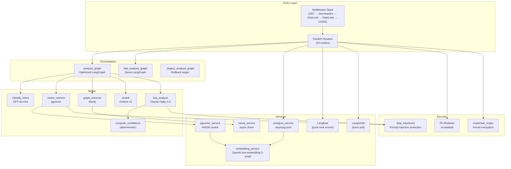
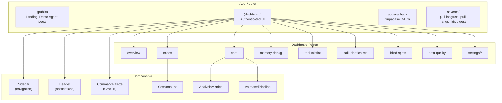

# Component Diagram

See [system-design.md](system-design.md) for the full system overview and [ARCHITECTURE.md](../../ARCHITECTURE.md) for the LangGraph pipeline Mermaid diagrams.

---

## Backend Components

---

## Frontend Components

