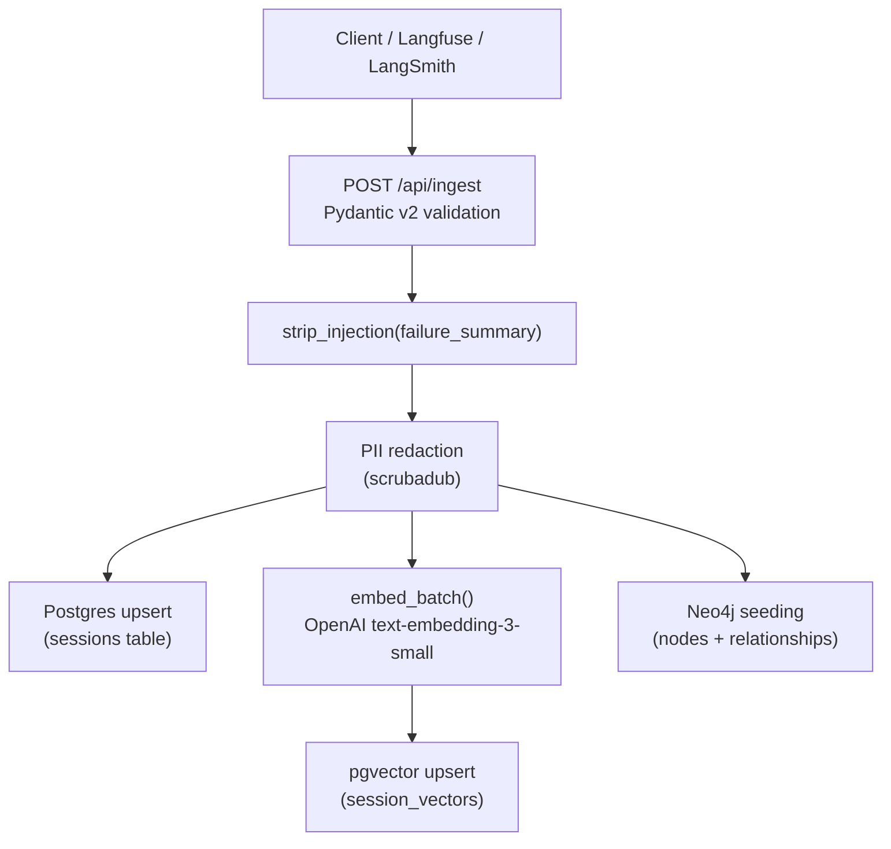
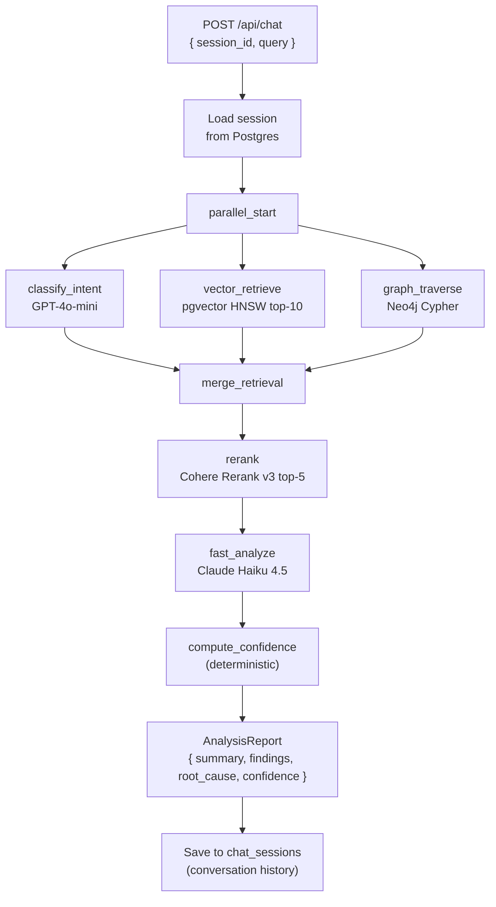
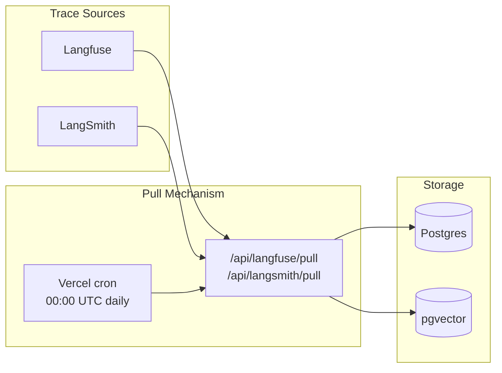

# Data Flow

---

## Ingestion Flow

After ingestion:
- Raw session JSON lives in `sessions` table (source of truth for all CRUD)
- Trace events live in `session_vectors` (vector search)
- Graph structure lives in Neo4j (cross-session traversal)

---

## Analysis Flow

Note: `rerank` runs after `merge_retrieval`, not in parallel — it needs the combined evidence list.

---

## Data at Rest

### PostgreSQL (`sessions` table)

| Column | Type | Description |
|---|---|---|
| `id` | UUID PK | Session identifier |
| `session_id` | TEXT UNIQUE | External session ID |
| `org_id` | UUID | Tenant identifier |
| `agent_id` | TEXT | Agent identifier |
| `outcome` | TEXT | `success` \| `failure` |
| `failure_type` | TEXT | Classified failure type |
| `session_data` | JSONB | Full session JSON including llm_calls, tool_calls, retrieval_events |
| `created_at` | TIMESTAMP | Ingest time |

### pgvector (`session_vectors` table)

| Column | Type | Description |
|---|---|---|
| `id` | TEXT PK | `{session_id}:{event_type}:{call_id}` |
| `session_id` | TEXT | Parent session |
| `namespace` | TEXT | `traces` \| `failure_patterns` |
| `org_id` | UUID | Tenant isolation |
| `event_type` | TEXT | `llm_call` \| `tool_call` \| `retrieval` \| `pattern` |
| `metadata` | JSONB | Rich metadata for filtering |
| `embedding` | vector(1536) | OpenAI embedding |

### Neo4j (Graph)

Nodes: `Session`, `Query`, `Chunk`, `ToolCall`, `Response`, `FailureEvent`, `BlindSpot`, `PromptVersion`

Relationships: 10+ types. See [system-design.md § Neo4j Graph Schema](system-design.md#neo4j-graph-schema).

---

## Data Lifecycle

| Stage | Action | Location |
|---|---|---|
| Ingest | PII redacted, injection stripped | Never stored raw if PII found |
| Embed | Text → 1 536-dim vector | `session_vectors` |
| Analyse | Evidence retrieved, LLM invoked | Ephemeral (state) |
| Report | AnalysisReport stored with chat session | `chat_messages` |
| Eval | Golden dataset compared against live runs | `data/eval_dataset.json` |
| Digest | Weekly summary generated | Email via Resend |

---

## Observability Data Flow

Traces can also be pulled on-demand via the dashboard (Settings → Integrations → Pull Now).
