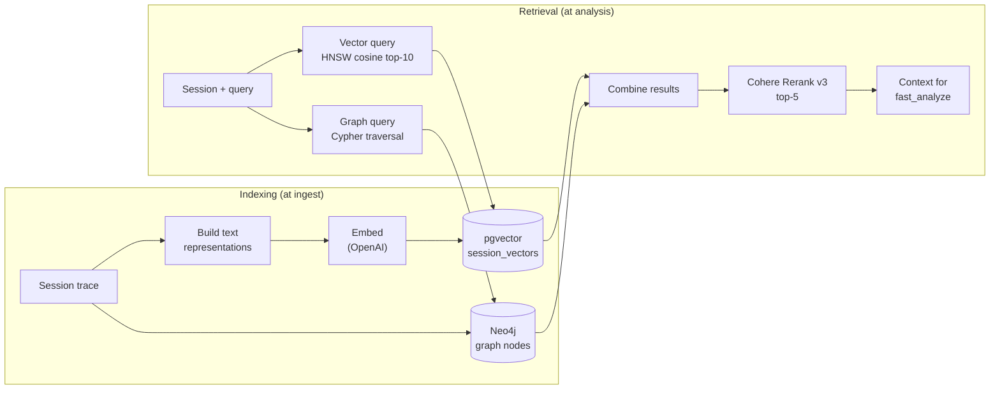

# RAG Pipeline

See the detailed docs in [docs/rag/](../rag/) for each component.

---

## Overview

Aethen uses a hybrid RAG approach combining dense vector search (pgvector) and graph-based retrieval (Neo4j), followed by neural reranking (Cohere).



---

## Two Retrieval Paths

### Dense Retrieval (pgvector)

- **What:** Cosine similarity between session failure pattern embeddings
- **Why:** Finds semantically similar past failures quickly
- **Namespace:** `failure_patterns` (session-level) + `traces` (event-level)
- **Top-k:** 10 (before reranking)

### Graph Retrieval (Neo4j)

- **What:** Cypher traversal finding sessions sharing failure types, tool calls, or blind spots
- **Why:** Vector search finds similar text; graph traversal finds structural relationships (e.g., "all sessions that encountered a timeout on the same tool")
- **Top-k:** Variable (graph query result set)

### Neural Reranking (Cohere)

- **What:** Cross-encoder rescoring of combined dense + graph results
- **Why:** Geometric proximity ≠ diagnostic relevance; reranker produces query-document relevance scores
- **Top-n:** 5 (after reranking)

---

## RAG for Blind Spot Detection

The Blind Spot module uses graph RAG specifically to find recurring knowledge gaps across sessions:

```cypher
MATCH (q:Query)-[:UNRESOLVED_DUE_TO]->(bs:BlindSpot)
WHERE bs.topic = $topic
RETURN DISTINCT s.session_id, s.agent_id
ORDER BY s.created_at DESC
LIMIT 10
```

This query cannot be expressed as vector similarity — it requires structural graph traversal to find the `BlindSpot` node and its connected queries across sessions.

---

## Complete Reference

| Component | Documentation |
|---|---|
| Indexing | [docs/rag/indexing.md](../rag/indexing.md) |
| Vector store | [docs/rag/vector-store.md](../rag/vector-store.md) |
| Embeddings | [docs/rag/embeddings.md](../rag/embeddings.md) |
| Retrieval | [docs/rag/retrieval.md](../rag/retrieval.md) |
| Chunking | [docs/rag/chunking.md](../rag/chunking.md) |
| Reranking | [docs/rag/reranking.md](../rag/reranking.md) |
| Context management | [docs/rag/context-management.md](../rag/context-management.md) |
