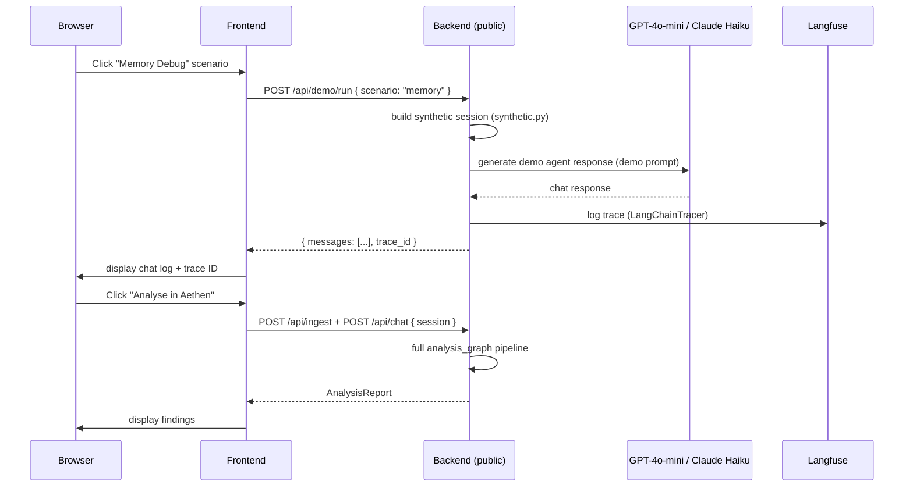
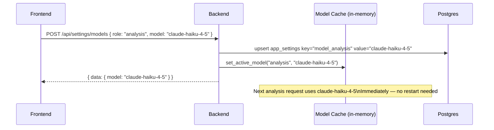
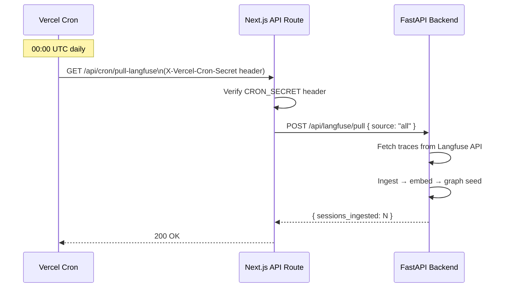
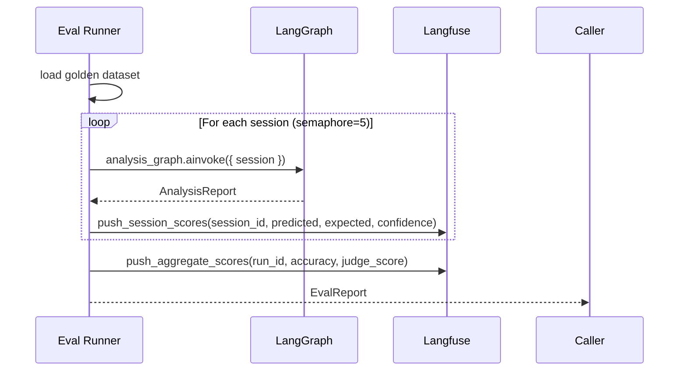

# Sequence Flows

See also: [ARCHITECTURE.md § Request Lifecycle](../../ARCHITECTURE.md#3-request-lifecycle) for the analysis and ingestion sequence diagrams.

---

## Demo Agent Flow

---

## Settings Model Update Flow

---

## Vercel Cron Flow

---

## Eval Push to Langfuse

