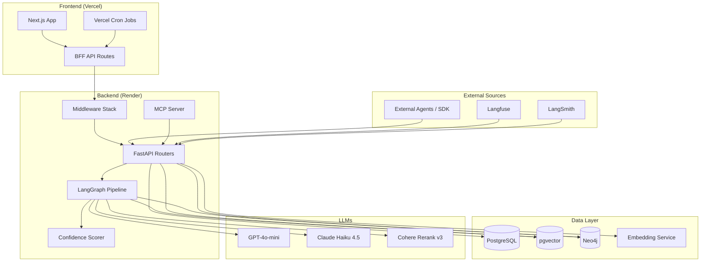

# System Design

---

## Overview

Aethen-AI is a three-tier application with a BFF pattern:

```
[Client Layer]
  Browser → Next.js App (Vercel)
  External → Python SDK (AethenClient)
  External → MCP-compatible agents

[BFF Layer — Next.js API Routes, Vercel]
  Route handlers proxy backend requests
  Vercel cron jobs (pull-langfuse, pull-langsmith, digest)
  Auth token forwarding

[Backend — FastAPI, Render]
  JWT middleware, security headers, rate limiting
  LangGraph analysis pipeline
  Service layer: PostgreSQL, pgvector, Neo4j, Langfuse, LangSmith
```

---

## Component Breakdown

| Component | Technology | Responsibility |
|---|---|---|
| **Frontend App** | Next.js 16.2 App Router | Dashboard UI, auth flow, demo agent page |
| **BFF API Routes** | Next.js Route Handlers | Proxy backend requests, add auth headers, cron jobs |
| **FastAPI App** | Python 3.11, FastAPI 0.136 | Request routing, middleware, response envelopes |
| **JWT Middleware** | Supabase Auth API | Verify bearer tokens, inject `user_id`, `org_id`, `is_admin` |
| **LangGraph Pipeline** | LangGraph 1.1.9 | Orchestrate classify → retrieve → analyze |
| **Intent Classifier** | GPT-4o-mini | Classify failure type (5-step priority chain) |
| **Vector Retrieval** | pgvector (asyncpg) | HNSW cosine search over `session_vectors` |
| **Graph Traversal** | Neo4j Aura | Cross-session failure pattern graph query |
| **Reranker** | Cohere Rerank v3 | Second-pass relevance reranking |
| **Fast Analyze** | Claude Haiku 4.5 | Combined analysis + synthesis (1 LLM call) |
| **Confidence Scorer** | Python (deterministic) | Evidence-based confidence from trace signals |
| **pgvector Service** | asyncpg + pgvector | Embed + store trace events, similarity search |
| **Neo4j Service** | neo4j async driver | Graph node/edge operations, blind spot detection |
| **Embedding Service** | OpenAI `text-embedding-3-small` | 1 536-dim embeddings for trace events |
| **PII Redactor** | scrubadub | Redact PII from trace data before storage |
| **MCP Server** | MCP SDK | Expose Aethen tools for external AI agents |

---

## System Interactions



---

## Design Principles

1. **Trace-only analysis** — Aethen never accesses the monitored agent's knowledge base or domain content. Every classification is made from observable execution trace signals only.

2. **Deterministic confidence** — `compute_confidence()` produces the same score for the same input every time. The LLM is not trusted to self-report confidence.

3. **Defence in depth** — Security is layered: schema validation → body size limit → rate limiting → JWT auth → prompt injection protection → PII redaction. Each layer is independent.

4. **Graceful degradation** — Missing services log warnings rather than crashing. `graph_traverse` returns `[]` when Neo4j is unavailable; analysis falls back to GPT-4o-mini when Anthropic is unavailable.

5. **Tenant isolation** — `org_id` scoping on every read/write. Admin users get `org_id=None` (no filter). Users without an org get a sentinel UUID (zero results).

6. **Async-first** — All I/O operations are `async` (asyncpg, neo4j async driver, httpx). LangGraph nodes are async coroutines.
