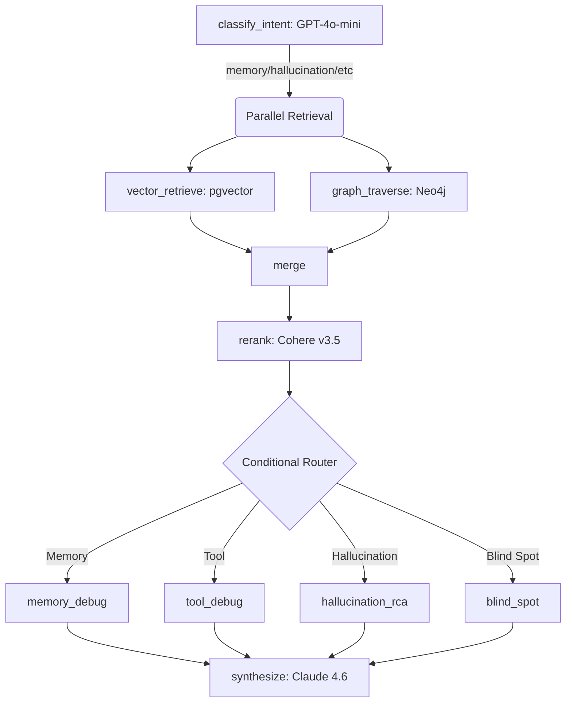

# Aethen-AI Architecture & UI Wireframes

## System Architecture

The system consists of a Next.js frontend and a FastAPI/LangGraph backend.

### Backend Pipeline (LangGraph)


### Demo Agent Flow
The Demo Agent UI provides an interactive, in-browser way to generate real traces without running scripts. It sits outside the LangGraph analysis pipeline and feeds directly into Langfuse:

```
User clicks scenario button (e.g. "Memory Debug")
    │
    ▼
POST /api/demo/run  { scenario: "memory" }
    │
    ├─► LangChain ChatOpenAI call (via OpenAI proxy)
    │       with Langfuse CallbackHandler attached
    │
    ├─► Response returned to frontend → displayed in chat log
    │
    └─► Trace flushed to Langfuse (visible in Langfuse dashboard)
            │
            ▼
    User clicks "Pull Langfuse" on dashboard
            │
            ▼
    POST /api/langfuse/pull → LangfuseProvider.fetch_traces()
            │
            ▼
    Sessions stored in store._sessions, classified by failure type
            │
            ▼
    Module pages show sessions in SessionsList → click to analyze
            │
            ▼
    POST /api/chat → full LangGraph pipeline → AnalysisReport
```

## UI Wireframes (Frontend Modules)

### 0. Demo Agent (`/demo-agent`)
**Goal:** Generate real LLM traces for each failure type directly from the browser — no scripts required.
```text
+-------------------------------------------------------------+
| Header: Demo Agent                                           |
| Subtitle: Generate real traces and watch them flow to        |
|           Langfuse → Pull → Analyze                         |
+-------------------------------------------------------------+
| Scenario Buttons:                                            |
| [ Memory Debug ] [ Tool Misfire ] [ Hallucination ] [ Blind Spot ] |
+-------------------------------------------------------------+
| Chat Log:                                                    |
|                                                              |
|  ┌─ Memory Debug ──────────────────── Traced to Langfuse ✓ ─┐|
|  │ You: "I can't reset my billing password. The retrieval    ||
|  │ system returned wrong documents about API keys..."        ||
|  │                                                           ||
|  │ Agent: "I can see there's an issue with your billing      ||
|  │ password. The support documents retrieved appear to be    ||
|  │ mismatched..."                                            ||
|  └───────────────────────────────────────────────────────────┘|
|  ┌─ Tool Misfire ──────────────────── Traced to Langfuse ✓ ─┐|
|  │ ...                                                        ||
|  └───────────────────────────────────────────────────────────┘|
+-------------------------------------------------------------+
| Footer: Pull Langfuse → navigate to module page to analyze   |
+-------------------------------------------------------------+
```

**Implementation**:
- Backend: `POST /api/demo/run { scenario: "memory" | "tool_misfire" | "hallucination" | "blind_spot" }`
  - Runs LangChain LLM call with Langfuse `CallbackHandler` attached
  - Returns `{ scenario_name, user_message, assistant_response, langfuse_traced }`
- Frontend: `frontend/src/app/(dashboard)/demo-agent/page.tsx`
  - 4 scenario buttons trigger individual LLM calls
  - Each response is appended to a running chat log with scenario label + Langfuse badge
  - Loading state per-button (can run multiple scenarios sequentially)

### 1. Memory Debug (`/memory-debug`)
**Goal:** Visualize retrieval failures (stale embeddings, missing chunks, low similarity).
```text
+-------------------------------------------------------------+
| Header: Memory Debug Analysis                               |
+-------------------------------------------------------------+
| [ Session ID Input / Selector ] [ Analyze Button ]          |
+-------------------------------------------------------------+
| Executive Summary (from Synthesize Node)                    |
| "Retrieval failed due to stale embeddings for doc-1..."     |
+-------------------------------------------------------------+
| Key Findings:                                               |
| [!] High Severity: Low similarity scores (avg 0.45)         |
| [ ] Medium Severity: Expected doc-1 missing from results    |
+-------------------------------------------------------------+
| Retrieval Events Timeline:                                  |
| 10:45:01 - Query: "how does billing work"                   |
|   ↳ Chunks: 3 | Max Score: 0.45 | Namespace: support-docs   |
+-------------------------------------------------------------+
```

### 2. Tool Misfire (`/tool-misfire`)
**Goal:** Visualize tool call failures, timeouts, and cascading errors.
```text
+-------------------------------------------------------------+
| Header: Tool Misfire Analysis                               |
+-------------------------------------------------------------+
| Executive Summary                                           |
| "Payment API timed out after 3 retries causing failure."    |
+-------------------------------------------------------------+
| Call Sequence (Waterfall view):                             |
| █ payment_api (30.0s) [TIMEOUT]                             |
|   ↳ Error: Connection timed out after 30s                   |
| █ payment_api (30.0s) [TIMEOUT]                             |
| █ payment_api (30.0s) [TIMEOUT]                             |
+-------------------------------------------------------------+
| Recommendations:                                            |
| - Implement circuit breaker for payment_api                 |
+-------------------------------------------------------------+
```

### 3. Hallucination RCA (`/hallucination-rca`)
**Goal:** Cross-reference LLM claims against source documents.
```text
+-------------------------------------------------------------+
| Header: Hallucination Root Cause Analysis                   |
+-------------------------------------------------------------+
| Grounding Score: 45% (Low Confidence)                       |
+-------------------------------------------------------------+
| LLM Response:                                               |
| "The billing cycle is [30 days] (Source: doc-3)."           |
|                                                             |
| Source Verification:                                        |
| ❌ [30 days] - Not found in doc-3. doc-3 says 14 days.      |
+-------------------------------------------------------------+
| Root Cause: Source Misattribution / Stale Context           |
+-------------------------------------------------------------+
```

### 4. Blind Spot Discovery (`/blind-spots`)
**Goal:** Identify systemic knowledge gaps across multiple sessions.
```text
+-------------------------------------------------------------+
| Header: Systemic Blind Spots                                |
+-------------------------------------------------------------+
| Cluster Map (Neo4j Graph Data):                             |
| (O) Billing Policies (14 failures)                          |
| (O) Enterprise SSO Setup (8 failures)                       |
| (o) Password Reset (2 failures)                             |
+-------------------------------------------------------------+
| Selected Cluster: Billing Policies                          |
| - 14 related sessions found                                 |
| - Common query: "pro-rated refunds"                         |
| - Action: Add 'billing-refunds' tool or update docs.        |
+-------------------------------------------------------------+
```
