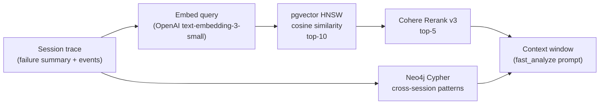

# Retrieval Pipeline

---

## Overview

Aethen uses a two-stage retrieval pipeline: vector similarity search (pgvector) followed by cross-encoder reranking (Cohere Rerank v3). Results feed the `fast_analyze` node as context for root cause reasoning.



---

## Vector Retrieval — pgvector

### Index

```sql
CREATE TABLE session_vectors (
    id           TEXT PRIMARY KEY,
    session_id   TEXT NOT NULL,
    namespace    TEXT NOT NULL,      -- "traces" | "failure_patterns"
    org_id       UUID,               -- tenant isolation
    event_type   TEXT,               -- "llm_call" | "tool_call" | "retrieval" | "pattern"
    metadata     JSONB,
    embedding    vector(1536)
);

CREATE INDEX ON session_vectors USING hnsw (embedding vector_cosine_ops);
```

### Query Strategy

`vector_retrieve` in `app/agents/nodes/retrieve.py` builds a rich query text from the session trace:

```python
query_parts = [
    session.failure_summary or "",                    # primary signal
    *[f"Query: {evt.query[:200]}" for evt in session.retrieval_events[:2]],
    *[f"Tool error ({tc.tool_name}): {tc.error}" for tc in session.tool_calls if tc.error],
]
query_text = " | ".join(p for p in query_parts if p)
```

Then queries both namespaces:
- `failure_patterns` — session-level failure summaries (similar past failures)
- `traces` — individual trace events (similar tool calls, LLM calls, retrieval events)

**Tenant isolation:** every query includes `org_id` filter to prevent cross-org data leakage.

**Current performance:** At dataset sizes up to ~100K vectors, exact cosine search is used (HNSW index disabled via `SET LOCAL enable_indexscan = off`). This eliminates HNSW approximation error at < 5 ms query time.

### Embed → Upsert Flow

`pgvector_service.upsert_session()` embeds every trace event in a session:

| Event type | Text representation |
|---|---|
| LLM call | `"LLM call: {prompt[:500]} -> {response[:500]}"` |
| Tool call | `"Tool call: {tool_name}({parameters}) -> {status}"` |
| Retrieval event | `"Retrieval: {query[:500]} -> {chunks_returned} chunks"` |
| Failure pattern | Rich summary: failure summary + query texts + avg scores + tool errors |

Embeddings use OpenAI `text-embedding-3-small` (1 536-dim) via `embedding_service.embed_batch()`.

---

## Graph Retrieval — Neo4j

`graph_traverse` in `app/agents/nodes/retrieve.py` queries Neo4j for sessions sharing the same `failure_type` and related failure events.

**Returns:** List of related session metadata (session_id, agent_id, failure_type) for context.

**Skip condition:** `AgentState["skip_graph"] = True` causes `graph_traverse` to return `[]` immediately without a Neo4j call (~3 s saved). Set when the caller knows no cross-session context is needed.

---

## Reranking — Cohere Rerank v3

`rerank` in `app/agents/nodes/rerank.py` applies a cross-encoder model to re-score the combined `vector_results + graph_results`:

```python
response = cohere_client.rerank(
    model="rerank-v3-nimble",
    query=query_text,
    documents=[r["content"] for r in combined],
    top_n=5,
)
```

Takes top-5 results post-rerank. If `COHERE_API_KEY` is unset, the node returns the original vector order (graceful degradation).

**Why reranking?** HNSW cosine similarity measures embedding distance, not semantic relevance to the specific diagnostic query. Cohere's cross-encoder model evaluates query-document relevance more precisely, surfacing the most diagnostic evidence for the root cause analysis.

---

## Context Construction

`fast_analyze` builds the LLM context window from:
1. Session trace fields (LLM calls, tool calls, retrieval events)
2. Top-3 similar failure patterns from pgvector (with score)

```
=== Similar Failure Patterns (from knowledge base) ===
[1] score=0.87: Memory failure | Query: "enterprise pricing docs" | Avg relevance: 0.28...
[2] score=0.81: Memory failure | Tool error (search_kb): ConnectionError...
[3] score=0.74: Memory failure | Query: "API rate limits" | No chunks retrieved...
```

The context window is capped (top-5 LLM calls, top-5 tool calls, top-3 retrieval events, top-3 evidence) to stay well within model token limits.

---

## Namespaces

| Namespace | Content | Used by |
|---|---|---|
| `traces` | Individual trace events (llm_call, tool_call, retrieval) | `vector_retrieve` |
| `failure_patterns` | Session-level failure summaries (one per failed session) | `vector_retrieve` |

Both namespaces are stored in the same `session_vectors` table, filtered by `namespace` column.
